# Fibre

[*Fibre*](https://portsmouth.github.io/fibre/) is a WebGL application for visualizing and coding 3d vector fields and dynamical systems. A number of presets with well-known or interesting dynamical systems are provided as below (click to launch). New vector fields can be authored in the code editor, and shared via an HTML link with the embedded code (via the `@` button).

<a href="https://portsmouth.github.io/fibre/?settings=eyJSIjp7InJheUJhdGNoIjoxMjgsIm1heFRpbWVTdGVwcyI6MjI5LCJtYXhJdGVyYXRpb25zIjoxMDAsImludGVncmF0aW9uVGltZSI6MTAsImludGVncmF0ZUZvcndhcmQiOnRydWUsImdyaWRTcGFjZSI6MC4wMjEyMzYyNjk2NTMyNDE0NCwidHViZVdpZHRoIjowLjAxNjU0MjIxNDA3NjEwMDgyMywidHViZVNwcmVhZCI6ZmFsc2UsInJlY29yZF9yZWFsdGltZSI6dHJ1ZSwieG1pbiI6LTAuMTM5NDgxNjE4OTY3NDY5NywieG1heCI6MC4xNTgyMzU2NjgwMTcyMDY1NywieW1pbiI6MC4yNTYzNjQzMDMxNzg5MDg5LCJ5bWF4IjowLjI4MTEwNDY3MDMxMTAyNzM3LCJ6bWluIjotMC41MzMyMzI0MTE5ODU3NTQsInptYXgiOi0wLjIwNDUzOTE2NDUxMDYxNzcsImNsaXBUb0JvdW5kcyI6ZmFsc2UsInNob3dCb3VuZHMiOnRydWUsImV4cG9zdXJlIjotMC45NzM5MzkyNjM0MDcyNzk3LCJnYW1tYSI6MS4wOTE3MDc4NzIyMDYyMTk1LCJjb250cmFzdCI6MS4xMjQ3ODk5Mjg5Mzk3NDE0LCJzYXR1cmF0aW9uIjoxLjM1MzkwOTExMDQ4ODkwOCwic3VidHJhY3RpdmVDb2xvciI6ZmFsc2UsImJnQ29sb3IiOlswLDAsMF0sImhhaXJTaGFkZXIiOmZhbHNlLCJzcGVjU2hpbmUiOjUzLjk1MjE4NjA4NjU4MTk1LCJzcGVjQ29sb3IiOlsxLDEsMV0sImxpZ2h0MV9jb2xvciI6WzEsMC45LDAuOF0sImxpZ2h0Ml9jb2xvciI6WzAuOCwwLjksMV0sImxpZ2h0MV9kaXIiOlswLjU3NzM1MDI2OTE4OTYyNTgsMC41NzczNTAyNjkxODk2MjU4LDAuNTc3MzUwMjY5MTg5NjI1OF0sImxpZ2h0Ml9kaXIiOlstMC41NzczNTAyNjkxODk2MjU4LC0wLjU3NzM1MDI2OTE4OTYyNTgsLTAuNTc3MzUwMjY5MTg5NjI1OF0sImRlcHRoVGVzdCI6dHJ1ZSwiZGFzaF9zcGFjaW5nIjowLjU0MDM0MDI1OTk4MDg1NzQsImRhc2hfc3BlZWQiOjMzLjA4MjA1NjczMzUyMTg5LCJkYXNoX3NpemUiOjAuOTE1MjcwMjM2Mjk0MTA1NSwiZGFzaGVzIjpmYWxzZSwic3VidHJhY3RpdmVfY29sb3IiOmZhbHNlLCJoYWlyU2hpbmUiOjEwLCJoYWlyU3BlY0NvbG9yIjpbMSwxLDFdfSwiQyI6eyJwb3MiOlsxLjYyNjE0OTEwMTA4MzM0MDcsMC45MDc0NjUzNzg2NzU1MjE3LC0yLjY3NTIxNTM2MzExNzk3MjNdLCJ0YXIiOlswLjIzMDMwMjcyMjEwODkxMjQ1LDAuMDE1MDExMDQyMDg5MzczMjQ3LDAuNzAxMDgzNDE5OTkxMzM3XSwibmVhciI6MC4wMzQ2NDEwMTYxNTEzNzc1NSwiZmFyIjozNDY0MS4wMTYxNTEzNzc1NDZ9LCJFIjp7ImNvZGUiOiJcbi8vLy8vLy8vLy8vLy8vLy8vLy8vLy8vLy8vLy8vLy8vLy8vLy8vLy8vLy9cbi8vIEFpemF3YSBhdHRyYWN0b3Jcbi8vLy8vLy8vLy8vLy8vLy8vLy8vLy8vLy8vLy8vLy8vLy8vLy8vLy8vLy9cblxuY29uc3QgZmxvYXQgYSA9IGZsb2F0KDEuMTAyKTtcbmNvbnN0IGZsb2F0IGIgPSBmbG9hdCgwLjgpO1xuY29uc3QgZmxvYXQgZSA9IGZsb2F0KDEuMTIyKTtcbmNvbnN0IGZsb2F0IGMgPSBmbG9hdCgwLjY4ODEyOCk7XG5jb25zdCBmbG9hdCBkID0gZmxvYXQoMS41KTtcbmNvbnN0IGZsb2F0IGYgPSBmbG9hdCgwLjEpO1xuXG4jZGVmaW5lIHJnYiB2ZWMzXG5cbmNvbnN0IHZlYzMgY29sTG8gPSByZ2IoMjU1LDYxLDg3KSAvIDI1NS4wO1xuY29uc3QgdmVjMyBjb2xIaSA9IHJnYigyNiw5OCwyNTMpIC8gMjU1LjA7XG5jb25zdCBmbG9hdCBtYWdTY2FsZSA9IGZsb2F0KDEuOTIpO1xuXG52ZWMzIHZlbG9jaXR5KHZlYzMgcCwgZmxvYXQgdClcbntcbiAgICB2ZWMzIHY7XG4gICAgZmxvYXQgeCA9IHAueDtcbiAgICBmbG9hdCB5ID0gcC55O1xuICAgIGZsb2F0IHogPSBwLno7XG4gICAgdi54ID0gKHogLSBiKSp4IC0gZCp5O1xuICAgIHYueSA9IGQqeCArICh6IC0gYikqeTtcbiAgICB2LnogPSBjICsgYSp6IC0gKHoqeip6LzMuMCkgLSAoeCp4ICsgeSp5KSooMS4wICsgZSp6KSArIGYqeip4KngqeDtcbiAgICByZXR1cm4gdjtcbn0gICAgXG4gXG52ZWMzIGNvbG9yKHZlYzMgcCwgZmxvYXQgdClcbntcbiAgICB2ZWMzIHYgPSB2ZWxvY2l0eShwLCB0KTtcbiAgICBmbG9hdCBtYWcyID0gdC9tYWdTY2FsZTtcbiAgICBmbG9hdCBsZXJwID0gbWFnMi8oMS4wK21hZzIpO1xuICAgIHJldHVybiAoMS4wLWxlcnApKmNvbExvICsgbGVycCpjb2xIaTtcbn0gIFxuIn19">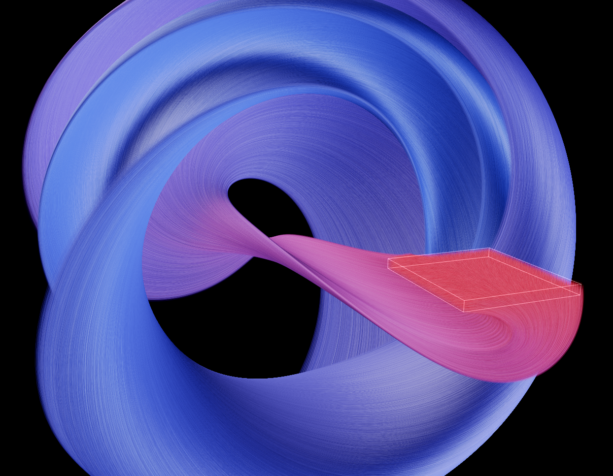</a><a href="https://portsmouth.github.io/fibre/?settings=eyJSIjp7InJheUJhdGNoIjoxMjgsIm1heFRpbWVTdGVwcyI6MjI5LCJtYXhJdGVyYXRpb25zIjoxMDAsImludGVncmF0aW9uVGltZSI6MTUsImludGVncmF0ZUZvcndhcmQiOnRydWUsImdyaWRTcGFjZSI6MC4wMzc1NjY3NzU4MDU2MTc3ODQsInR1YmVXaWR0aCI6MC4wMjE0MDI3MjI3Mjk2MjI2MSwidHViZVNwcmVhZCI6ZmFsc2UsInJlY29yZF9yZWFsdGltZSI6dHJ1ZSwieG1pbiI6LTAuMjcyOTU5MTU2MjMyOTkwNSwieG1heCI6MC43MjcwNDA4NDM3NjcwMDkxLCJ5bWluIjotMC45MjcwMDk3ODMyODMxNDg1LCJ5bWF4IjotMC42OTM3NjkxMTQ2NzMwMTIsInptaW4iOi0yLjM3NTE2ODQxODgwNzIyOSwiem1heCI6LTIuMjcxODMwNjc2ODM2MjYzLCJjbGlwVG9Cb3VuZHMiOmZhbHNlLCJzaG93Qm91bmRzIjp0cnVlLCJleHBvc3VyZSI6LTAuNzM2MzYwMTE3MzgzNTM4OCwiZ2FtbWEiOjAuNzQxMzQwNjg1ODUyMTQ1NCwiY29udHJhc3QiOjAuOTcyOTQ1MDI4NDMzNTY4OSwic2F0dXJhdGlvbiI6MS41MzU0MTI3MTc1NTk4ODMsInN1YnRyYWN0aXZlQ29sb3IiOmZhbHNlLCJiZ0NvbG9yIjpbMCwwLDBdLCJoYWlyU2hhZGVyIjpmYWxzZSwic3BlY1NoaW5lIjoyMi41MDU2MDA1NTE0Mzg5MTMsInNwZWNDb2xvciI6WzAuOTAxOTUzMjc1MDg4MDg4MSwwLjg5MzEwOTkxODYyMzQ5MjEsMC44OTMxMDk5MTg2MjM0OTIxXSwibGlnaHQxX2NvbG9yIjpbMSwwLjksMC44XSwibGlnaHQyX2NvbG9yIjpbMC44LDAuOSwxXSwibGlnaHQxX2RpciI6WzAuNTc3MzUwMjY5MTg5NjI1OCwwLjU3NzM1MDI2OTE4OTYyNTgsMC41NzczNTAyNjkxODk2MjU4XSwibGlnaHQyX2RpciI6Wy0wLjU3NzM1MDI2OTE4OTYyNTgsLTAuNTc3MzUwMjY5MTg5NjI1OCwtMC41NzczNTAyNjkxODk2MjU4XSwiZGVwdGhUZXN0Ijp0cnVlLCJkYXNoX3NwYWNpbmciOjAuNTQwMzQwMjU5OTgwODU3NCwiZGFzaF9zcGVlZCI6MzMuMDgyMDU2NzMzNTIxODksImRhc2hfc2l6ZSI6MC45MTUyNzAyMzYyOTQxMDU1LCJkYXNoZXMiOmZhbHNlLCJzdWJ0cmFjdGl2ZV9jb2xvciI6ZmFsc2UsImhhaXJTaGluZSI6MTAsImhhaXJTcGVjQ29sb3IiOlsxLDEsMV19LCJDIjp7InBvcyI6WzEuNTAxMzMwMjA1ODc1MjkyNiwyLjQwODA0MzgxNTM4MDk3MSwtOS41MDM2Nzk3MDQ0MTAwMjddLCJ0YXIiOlswLjM5NTU2NjYyODc4MzA2OTUzLC0wLjIxOTAzMzUxNDMyMjY0MTA0LC0xLjYzNTUxMzY2NTY0OTA5MTRdLCJuZWFyIjowLjAzNDY0MTAxNjE1MTM3NzU1LCJmYXIiOjM0NjQxLjAxNjE1MTM3NzU0Nn0sIkUiOnsiY29kZSI6IlxuLy8vLy8vLy8vLy8vLy8vLy8vLy8vLy8vLy8vLy8vLy8vLy8vLy8vLy8vL1xuLy8gQXJuZW9kbyBhdHRyYWN0b3Jcbi8vLy8vLy8vLy8vLy8vLy8vLy8vLy8vLy8vLy8vLy8vLy8vLy8vLy8vLy9cblxuY29uc3QgZmxvYXQgYSA9IGZsb2F0KC00LjUpO1xuY29uc3QgZmxvYXQgYiA9IGZsb2F0KDUuNSk7XG5jb25zdCBmbG9hdCBjID0gZmxvYXQoLTEuMCk7XG5cbiNkZWZpbmUgcmdiIHZlYzNcblxuY29uc3QgdmVjMyBjb2xMbyA9IHJnYigyNTQsNDUsNzMpIC8gMjU1LjA7XG5jb25zdCB2ZWMzIGNvbEhpID0gcmdiKDUsMTM4LDI1NSkgLyAyNTUuMDtcbmNvbnN0IGZsb2F0IG1hZ1NjYWxlID0gZmxvYXQoNS4wNjU1MzYpO1xuXG52ZWMzIHZlbG9jaXR5KHZlYzMgcCwgZmxvYXQgdClcbntcblx0dmVjMyB2O1xuXHRmbG9hdCB4ID0gcC54O1xuXHRmbG9hdCB5ID0gcC55O1xuXHRmbG9hdCB6ID0gcC56O1xuXHR2LnggPSB5O1xuIFx0di55ID0gejsgXG4gXHR2LnogPSAtYSp4IC0gYip5IC0geiArIGMqeCp4Kng7XG4gXHRyZXR1cm4gdjtcbn0gICAgXG4gXG52ZWMzIGNvbG9yKHZlYzMgcCwgZmxvYXQgdClcbntcbiAgICB2ZWMzIHYgPSB2ZWxvY2l0eShwLCB0KTtcbiAgXHRmbG9hdCBtYWcyID0gdC9tYWdTY2FsZTtcbiAgICBmbG9hdCBsZXJwID0gbWFnMi8oMS4wK21hZzIpO1xuICAgIHJldHVybiAoMS4wLWxlcnApKmNvbExvICsgbGVycCpjb2xIaTtcbn0gIFxuIn19">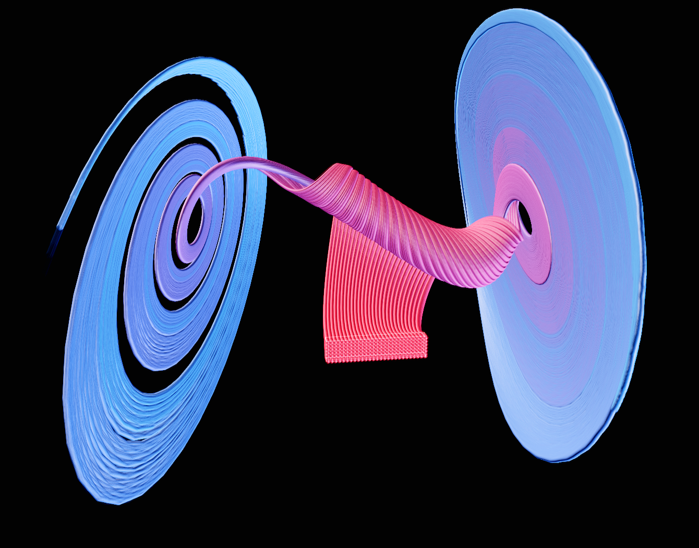</a><a href="https://portsmouth.github.io/fibre/?settings=eyJSIjp7InJheUJhdGNoIjoxMjgsIm1heFRpbWVTdGVwcyI6MjU2LCJtYXhJdGVyYXRpb25zIjoxMDAsImludGVncmF0aW9uVGltZSI6OCwiaW50ZWdyYXRlRm9yd2FyZCI6dHJ1ZSwiZ3JpZFNwYWNlIjowLjAyNjUzNzk5NzU4NzQ1NDc2NiwidHViZVdpZHRoIjowLjAyMDI5OTg0NDkwNzgwNjMxLCJ0dWJlU3ByZWFkIjpmYWxzZSwicmVjb3JkX3JlYWx0aW1lIjp0cnVlLCJ4bWluIjotMy45ODk4MDE5MzUwNjIwNzY2LCJ4bWF4IjotMi4xMDE4OTgwODY4MzQ0ODE2LCJ5bWluIjo1LjMzOTMzNTM2ODg3MDcwMywieW1heCI6NS40Mjg5Nzg0ODI0NjQ0Niwiem1pbiI6LTEuMTE5MTgwMTgxMjczNTMzNiwiem1heCI6Mi45NjA3MzA2NjQzNTMwMDYyLCJjbGlwVG9Cb3VuZHMiOmZhbHNlLCJzaG93Qm91bmRzIjp0cnVlLCJleHBvc3VyZSI6LTAuNDI1NjQxOTA5MzU3MjMwMSwiZ2FtbWEiOjIuMiwiY29udHJhc3QiOjEuMTYzODQ3NzgwMTI2ODQ5OSwic2F0dXJhdGlvbiI6MS40MDA2MzQyNDk0NzE0NTg4LCJzdWJ0cmFjdGl2ZUNvbG9yIjpmYWxzZSwiYmdDb2xvciI6WzAsMCwwXSwiaGFpclNoYWRlciI6ZmFsc2UsInNwZWNTaGluZSI6MzguNzk0OTI2MDA0MjI4MzMsInNwZWNDb2xvciI6WzEsMSwxXSwibGlnaHQxX2NvbG9yIjpbMSwxLDFdLCJsaWdodDJfY29sb3IiOlsxLDEsMV0sImxpZ2h0MV9kaXIiOlswLDAuMTE3NjQ3MDU4ODIzNTI5ODgsMV0sImxpZ2h0Ml9kaXIiOlsxLDAsMF0sImRlcHRoVGVzdCI6dHJ1ZSwiZGFzaF9zcGFjaW5nIjowLjA1LCJkYXNoX3NwZWVkIjoxMCwiZGFzaF9zaXplIjowLjUsImRhc2hlcyI6ZmFsc2UsInN1YnRyYWN0aXZlX2NvbG9yIjpmYWxzZSwiaGFpclNoaW5lIjoxMCwiaGFpclNwZWNDb2xvciI6WzEsMSwxXX0sIkMiOnsicG9zIjpbNS4zOTI1NjY3NzUxMDQxODcsMTMuMDE0MzI2NzM3NzUzMTQ0LDI0LjgwMDY1ODk0NTYzODExMl0sInRhciI6Wy0xLjc2MDYzNzEyMjY3NTk4NzQsNy44NzQxNzYyOTA3Mjk5NjUsMS4xNTk5MjIxNjkxNDY4NjQyXSwibmVhciI6MC4wMzQ2NDEwMTYxNTEzNzc1NSwiZmFyIjozNDY0MS4wMTYxNTEzNzc1NDZ9LCJFIjp7ImNvZGUiOiJcbi8vLy8vLy8vLy8vLy8vLy8vLy8vLy8vLy8vLy8vLy8vLy8vLy8vLy8vLy9cbi8vIEJvdWFsaSBhdHRyYWN0b3Jcbi8vLy8vLy8vLy8vLy8vLy8vLy8vLy8vLy8vLy8vLy8vLy8vLy8vLy8vLy9cblxuY29uc3QgZmxvYXQgYSAgICAgPSBmbG9hdCg0LjApO1xuY29uc3QgZmxvYXQgYiAgICAgPSBmbG9hdCgxLjApO1xuY29uc3QgZmxvYXQgYWxmYSAgPSBmbG9hdCgwLjMpOyBcbmNvbnN0IGZsb2F0IGJldGEgID0gZmxvYXQoMC4wNSk7XG5jb25zdCBmbG9hdCBjICAgICA9IGZsb2F0KDEuNSk7XG5jb25zdCBmbG9hdCBzICAgICA9IGZsb2F0KDEuMCk7XG5cbiNkZWZpbmUgcmdiIHZlYzNcblxuY29uc3QgdmVjMyBjb2xMbyA9IHJnYigyNTUsMjAsNTUpIC8gMjU1LjA7XG5jb25zdCB2ZWMzIGNvbEhpID0gcmdiKDAsNDAsMjE5KSAvIDI1NS4wO1xuY29uc3QgZmxvYXQgbWFnU2NhbGUgPSBmbG9hdCgxLjc4OTU2OCk7XG5cbiB2ZWMzIHZlbG9jaXR5KHZlYzMgcCwgZmxvYXQgdClcbiB7XG4gICAgIHZlYzMgdjtcbiAgICAgZmxvYXQgeCA9IHAueDtcbiAgICAgZmxvYXQgeSA9IHAueTtcbiAgICAgZmxvYXQgeiA9IHAuejtcbiAgICAgdi54ID0geCooYSAtIHkpICsgYWxmYSp6O1xuICAgICB2LnkgPSAteSooYiAtIHgqeCk7XG4gICAgIHYueiA9IC14KihjIC0gcyp6KSAtIGJldGEqejtcbiAgICAgcmV0dXJuIHY7XG4gfSAgICBcbiBcbnZlYzMgY29sb3IodmVjMyBwLCBmbG9hdCB0KVxue1xuICAgIHZlYzMgdiA9IHZlbG9jaXR5KHAsIHQpO1xuICBcdGZsb2F0IG1hZzIgPSB0L21hZ1NjYWxlO1xuICAgIGZsb2F0IGxlcnAgPSBtYWcyLygxLjArbWFnMik7XG4gICAgcmV0dXJuICgxLjAtbGVycCkqY29sTG8gKyBsZXJwKmNvbEhpO1xufSAgXG4ifX0%3D">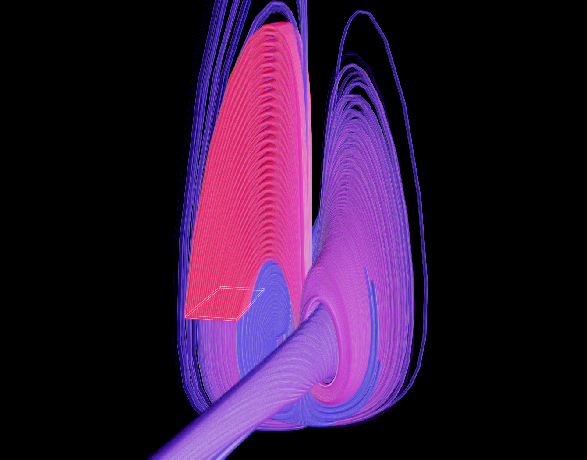</a>
<a href="https://portsmouth.github.io/fibre/?settings=eyJSIjp7InJheUJhdGNoIjoxMjgsIm1heFRpbWVTdGVwcyI6MjU2LCJtYXhJdGVyYXRpb25zIjoxMDAsImludGVncmF0aW9uVGltZSI6NiwiaW50ZWdyYXRlRm9yd2FyZCI6dHJ1ZSwiZ3JpZFNwYWNlIjowLjAzMjI2MzYyMjY1Nzc2NDM3NiwidHViZVdpZHRoIjowLjAxOTc2NzM5MTc3MjU2MDg0NCwidHViZVNwcmVhZCI6ZmFsc2UsInJlY29yZF9yZWFsdGltZSI6dHJ1ZSwieG1pbiI6MS40NjI1MjY3MjQ2OTY4NDYsInhtYXgiOjIuNjYwNjkxNjA4OTY1ODkxLCJ5bWluIjotMi4yOTM2MDg1Nzg1NzM3NTUsInltYXgiOi0wLjc0NTM3MzI5OTMyNzQ3NDQsInptaW4iOjIuMTg5MTkzOTE0NDExODUxNSwiem1heCI6NC4yODE4NTcyMjIwOTM3MjgsImNsaXBUb0JvdW5kcyI6ZmFsc2UsInNob3dCb3VuZHMiOnRydWUsImV4cG9zdXJlIjotMSwiZ2FtbWEiOjAuNTYyMzk0OTY0NDY5ODcwNywiY29udHJhc3QiOjEsInNhdHVyYXRpb24iOjEuMSwic3VidHJhY3RpdmVDb2xvciI6ZmFsc2UsImJnQ29sb3IiOlswLDAsMF0sImhhaXJTaGFkZXIiOmZhbHNlLCJzcGVjU2hpbmUiOjYwLjU2ODU5Nzg4OTI5NTcyLCJzcGVjQ29sb3IiOlswLjU2NTQ5MjE0ODYwMjA2ODEsMC41NjU0OTIxNDg2MDIwNjgxLDAuNTY1NDkyMTQ4NjAyMDY4MV0sImxpZ2h0MV9jb2xvciI6WzEsMC45LDAuOF0sImxpZ2h0Ml9jb2xvciI6WzAuOCwwLjksMV0sImxpZ2h0MV9kaXIiOlswLjU3NzM1MDI2OTE4OTYyNTgsMC41NzczNTAyNjkxODk2MjU4LDAuNTc3MzUwMjY5MTg5NjI1OF0sImxpZ2h0Ml9kaXIiOlstMC41NzczNTAyNjkxODk2MjU4LC0wLjU3NzM1MDI2OTE4OTYyNTgsLTAuNTc3MzUwMjY5MTg5NjI1OF0sImRlcHRoVGVzdCI6dHJ1ZSwiZGFzaF9zcGFjaW5nIjowLjU0MDM0MDI1OTk4MDg1NzQsImRhc2hfc3BlZWQiOjMzLjA4MjA1NjczMzUyMTg5LCJkYXNoX3NpemUiOjAuOTE1MjcwMjM2Mjk0MTA1NSwiZGFzaGVzIjpmYWxzZSwic3VidHJhY3RpdmVfY29sb3IiOmZhbHNlLCJoYWlyU2hpbmUiOjEwLCJoYWlyU3BlY0NvbG9yIjpbMSwxLDFdfSwiQyI6eyJwb3MiOls4LjY2Nzg3MDcwNTg1MTc5NSwxMC42NTIyODI0OTUyOTQ0NjUsLTEyLjM0MjgxNDcwMTMwMDc2Nl0sInRhciI6WzEuNTQ4MDQyODk4NTA2MTU2NywwLjI0ODcxNzEwMTgyMzQ4MTA4LDEwLjY0MTA4NDg5MzMxNTgyNl0sIm5lYXIiOjAuMDM0NjQxMDE2MTUxMzc3NTUsImZhciI6MzQ2NDEuMDE2MTUxMzc3NTQ2fSwiRSI6eyJjb2RlIjoiXG4vLy8vLy8vLy8vLy8vLy8vLy8vLy8vLy8vLy8vLy8vLy8vLy8vLy8vLy8vXG4vLyBDaGVuLUxlZSBhdHRyYWN0b3Jcbi8vLy8vLy8vLy8vLy8vLy8vLy8vLy8vLy8vLy8vLy8vLy8vLy8vLy8vLy9cblxuY29uc3QgZmxvYXQgYSA9IGZsb2F0KDUpO1xuY29uc3QgZmxvYXQgYiA9IGZsb2F0KC0xMC4wKTtcbmNvbnN0IGZsb2F0IGMgPSBmbG9hdCgtMC4zOCk7XG5cbiNkZWZpbmUgcmdiIHZlYzNcblxuY29uc3QgdmVjMyBjb2xMbyA9IHJnYigyNTUsNjEsODcpIC8gMjU1LjA7XG5jb25zdCB2ZWMzIGNvbEhpID0gcmdiKDU3LDExNiwyNTQpIC8gMjU1LjA7XG5jb25zdCBmbG9hdCBtYWdTY2FsZSA9IGZsb2F0KDAuNzMxMTM2KTtcblxudmVjMyB2ZWxvY2l0eSh2ZWMzIHAsIGZsb2F0IHQpXG57XG4gICAgdmVjMyB2O1xuICAgIGZsb2F0IHggPSBwLng7XG4gICAgZmxvYXQgeSA9IHAueTtcbiAgICBmbG9hdCB6ID0gcC56O1xuICAgIHYueCA9IGEqeCAtIHkqejtcbiAgICB2LnkgPSBiKnkgKyB4Kno7XG4gICAgdi56ID0gYyp6ICsgeCp5O1xuICAgIHJldHVybiB2O1xufSAgICBcbiBcbnZlYzMgY29sb3IodmVjMyBwLCBmbG9hdCB0KVxue1xuICAgIHZlYzMgdiA9IHZlbG9jaXR5KHAsIHQpO1xuICAgIGZsb2F0IG1hZzIgPSB0L21hZ1NjYWxlO1xuICAgIGZsb2F0IGxlcnAgPSBtYWcyLygxLjArbWFnMik7XG4gICAgcmV0dXJuICgxLjAtbGVycCkqY29sTG8gKyBsZXJwKmNvbEhpO1xufSAgXG4ifX0%3D">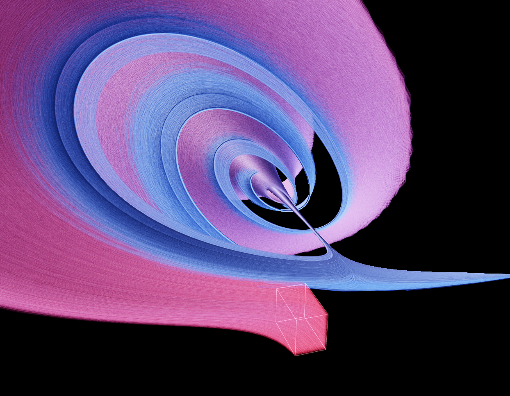</a>
<a href="https://portsmouth.github.io/fibre/?settings=eyJSIjp7InJheUJhdGNoIjoxMzgsIm1heFRpbWVTdGVwcyI6MTI4LCJtYXhJdGVyYXRpb25zIjo1MjMuMTk4MzQwNzM1OTA0MSwiaW50ZWdyYXRpb25UaW1lIjo1LCJpbnRlZ3JhdGVGb3J3YXJkIjpmYWxzZSwiZ3JpZFNwYWNlIjowLjA2NTM0NTY4MTY3MTMzMzE5LCJ0dWJlV2lkdGgiOjAuMDAzMzA4NjMyNTUzMTk0NTM4NSwidHViZVNwcmVhZCI6ZmFsc2UsInJlY29yZF9yZWFsdGltZSI6dHJ1ZSwieG1pbiI6LTIuMjYyNzAxMzM4MzY1OTgsInhtYXgiOjIuMTM3Mjk4NjYxNjM0MDIwNCwieW1pbiI6LTIuNjAyNjA4MTI0Mzg1ODY0MywieW1heCI6Mi4yODkxMDk0OTY5MTY5MjcsInptaW4iOi0wLjUyOTI5OTMwNzc0NTgzNTIsInptYXgiOjAuMjkzNzIwMTUyNDI3OTc0LCJjbGlwVG9Cb3VuZHMiOmZhbHNlLCJzaG93Qm91bmRzIjp0cnVlLCJleHBvc3VyZSI6LTAuMzEyMjk4MDgzMTM1OTAzNywiZ2FtbWEiOjIuMiwiY29udHJhc3QiOjEuMTkxMDM5NDEzNDc5MjU5Miwic2F0dXJhdGlvbiI6MS42NTE2NDc2NDE2MTEwMjc1LCJzdWJ0cmFjdGl2ZUNvbG9yIjpmYWxzZSwiYmdDb2xvciI6WzAsMCwwXSwiaGFpclNoYWRlciI6ZmFsc2UsInNwZWNTaGluZSI6MTUuNDQwMjg1MjQ4MjQxMTc4LCJzcGVjQ29sb3IiOlswLjQ3NzI1MDA5NTc0ODc1NTMsMC40NzcyNTAwOTU3NDg3NTUzLDAuNDc3MjUwMDk1NzQ4NzU1M10sImxpZ2h0MV9jb2xvciI6WzEsMC45LDAuOF0sImxpZ2h0Ml9jb2xvciI6WzAuOCwwLjksMV0sImxpZ2h0MV9kaXIiOlswLjU3NzM1MDI2OTE4OTYyNTgsMC41NzczNTAyNjkxODk2MjU4LDAuNTc3MzUwMjY5MTg5NjI1OF0sImxpZ2h0Ml9kaXIiOlstMC41NzczNTAyNjkxODk2MjU4LC0wLjU3NzM1MDI2OTE4OTYyNTgsLTAuNTc3MzUwMjY5MTg5NjI1OF0sImRlcHRoVGVzdCI6dHJ1ZSwiZGFzaF9zcGFjaW5nIjowLjQ5NjMyMzM0NjkzOTk0NDgsImRhc2hfc3BlZWQiOjEwLCJkYXNoX3NpemUiOjAuMzA4ODIzNDE1ODczNzQzNCwiZGFzaGVzIjpmYWxzZSwic3VidHJhY3RpdmVfY29sb3IiOmZhbHNlLCJoYWlyU2hpbmUiOjEwLCJoYWlyU3BlY0NvbG9yIjpbMSwxLDFdfSwiQyI6eyJwb3MiOlstMy42NzE3MjU5NDc1NzY4MywxLjc4NTk5ODg5MDg1Mjk0NzIsLTguMjc0MDEyMzY2NDQ0MTQzXSwidGFyIjpbLTAuMzI0Nzc5ODIwMDYxNTYyNzUsLTAuMjcwNTI5MDg3MjIyMjc0NTMsMC4yODg1NDU4MDAwMDg5ODY3XSwibmVhciI6MC4wMzQ2NDEwMTYxNTEzNzc1NSwiZmFyIjozNDY0MS4wMTYxNTEzNzc1NDZ9LCJFIjp7ImNvZGUiOiIvLy8vLy8vLy8vLy8vLy8vLy8vLy8vLy8vLy8vLy8vLy8vLy8vLy8vLy8vXG4vLyBEaXBvbGUgZmllbGRcbi8vLy8vLy8vLy8vLy8vLy8vLy8vLy8vLy8vLy8vLy8vLy8vLy8vLy8vLy9cblxuI2RlZmluZSByZ2IgdmVjM1xuXG5jb25zdCB2ZWMzIGNvbExvID0gcmdiKDAsNiwxODMpIC8gMjU1LjA7XG5jb25zdCB2ZWMzIGNvbEhpID0gcmdiKDIzOSwxMSwwKSAvIDI1NS4wO1xuY29uc3QgZmxvYXQgbWFnU2NhbGUgPSAyLjQ7XG5cbnZlYzMgRShmbG9hdCBxLCBpbiB2ZWMzIHAsIHZlYzMgYylcbntcbiAgICB2ZWMzIHBjID0gcCAtIGM7XG4gICAgZmxvYXQgcjIgPSBkb3QocGMsIHBjKTtcbiAgICB2ZWMzIEUgPSBxICogKHAtYykgLyAocG93KHIyLCAxLjUpICsgMS4wZS0yKTtcbiAgICByZXR1cm4gRTtcbn1cblxudmVjMyB2ZWxvY2l0eSh2ZWMzIHAsIGZsb2F0IHQpXG57XG4gICAgdmVjMyB4MCA9IHZlYzMoMCwgIDAuNSwgMCk7XG4gICAgdmVjMyB4MSA9IHZlYzMoMCwgLTAuNSwgMCk7XG4gICAgcmV0dXJuIEUoLTEuMCwgcCwgeDApICsgRSgxLjAsIHAsIHgxKTtcbn0gICAgXG5cbnZlYzMgY29sb3IodmVjMyBwLCBmbG9hdCB0KVxue1xuICAgIHZlYzMgRSA9IHZlbG9jaXR5KHAsIHQpO1xuICBcdGZsb2F0IG1hZzIgPSBkb3QoRSxFKSAvIChtYWdTY2FsZSptYWdTY2FsZSk7XG4gICAgZmxvYXQgbGVycCA9IG1hZzIvKDEuMCttYWcyKTtcbiAgICByZXR1cm4gKDEuMC1sZXJwKSpjb2xMbyArIGxlcnAqY29sSGk7XG59ICBcbiJ9fQ%3D%3D">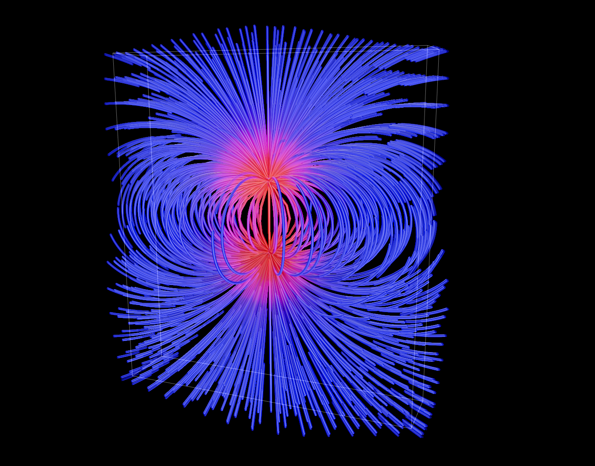</a><a href="https://portsmouth.github.io/fibre/?settings=eyJSIjp7InJheUJhdGNoIjoxMjgsIm1heFRpbWVTdGVwcyI6MzE5LCJtYXhJdGVyYXRpb25zIjoxMDAsImludGVncmF0aW9uVGltZSI6MjAsImludGVncmF0ZUZvcndhcmQiOnRydWUsImdyaWRTcGFjZSI6MC4wMDUsInR1YmVXaWR0aCI6MC4wMTg3NDc4NDI2MTk1ODA5MzIsInR1YmVTcHJlYWQiOmZhbHNlLCJyZWNvcmRfcmVhbHRpbWUiOnRydWUsInhtaW4iOi0xLjg0MjQzOTkxMzY3MjEzMjEsInhtYXgiOi0xLjY5NzQwMDg2MTM5ODUwMjUsInltaW4iOi0wLjc1MDc5Mzc1MTk1Njc2MDIsInltYXgiOi0wLjI5OTU4ODE4NTU3MDA5MzE1LCJ6bWluIjotMC44MTQyMDU1NzE1Mzg3ODkzLCJ6bWF4IjotMC43NTYwODExMDg1OTM5NzI5LCJjbGlwVG9Cb3VuZHMiOmZhbHNlLCJzaG93Qm91bmRzIjp0cnVlLCJleHBvc3VyZSI6LTEuMTc3NDg1ODI2MDc5NTYxLCJnYW1tYSI6MS4wMjU2MTcyNzI3MTgyNTEsImNvbnRyYXN0IjoxLjI5MDI5MjY5NzkzNTg2NDIsInNhdHVyYXRpb24iOjEuNDU1NzE0ODM4Njk2ODcyMywic3VidHJhY3RpdmVDb2xvciI6ZmFsc2UsImJnQ29sb3IiOlswLDAsMF0sImhhaXJTaGFkZXIiOmZhbHNlLCJzcGVjU2hpbmUiOjMxLjg5NzQ4MDA3NzUzNjA3Nywic3BlY0NvbG9yIjpbMSwxLDFdLCJsaWdodDFfY29sb3IiOlsxLDAuOSwwLjhdLCJsaWdodDJfY29sb3IiOlswLjgsMC45LDFdLCJsaWdodDFfZGlyIjpbMC41NzczNTAyNjkxODk2MjU4LDAuNTc3MzUwMjY5MTg5NjI1OCwwLjU3NzM1MDI2OTE4OTYyNThdLCJsaWdodDJfZGlyIjpbLTAuNTc3MzUwMjY5MTg5NjI1OCwtMC41NzczNTAyNjkxODk2MjU4LC0wLjU3NzM1MDI2OTE4OTYyNThdLCJkZXB0aFRlc3QiOnRydWUsImRhc2hfc3BhY2luZyI6MC41NDAzNDAyNTk5ODA4NTc0LCJkYXNoX3NwZWVkIjozMy4wODIwNTY3MzM1MjE4OSwiZGFzaF9zaXplIjowLjkxNTI3MDIzNjI5NDEwNTUsImRhc2hlcyI6ZmFsc2UsInN1YnRyYWN0aXZlX2NvbG9yIjpmYWxzZSwiaGFpclNoaW5lIjoxMCwiaGFpclNwZWNDb2xvciI6WzEsMSwxXX0sIkMiOnsicG9zIjpbLTQuMjgwNDkyMTM4MTY3OTY3NSwwLjg4NDU1MjA5Nzk1NTE3MSwtMy40OTI3MzM4Njc0MzM3ODFdLCJ0YXIiOlswLjQ0MzkwMDY5MjE1MTE1OTUsMC4xMDk3ODc2ODUzODYxNzI1MywtMC4xNDE1NTE2NDc4Mzk3MTEzXSwibmVhciI6MC4wMzQ2NDEwMTYxNTEzNzc1NSwiZmFyIjozNDY0MS4wMTYxNTEzNzc1NDZ9LCJFIjp7ImNvZGUiOiJcbi8vLy8vLy8vLy8vLy8vLy8vLy8vLy8vLy8vLy8vLy8vLy8vLy8vLy8vLy9cbi8vIEhhZGxleSBhdHRyYWN0b3Jcbi8vLy8vLy8vLy8vLy8vLy8vLy8vLy8vLy8vLy8vLy8vLy8vLy8vLy8vLy9cblxuY29uc3QgZmxvYXQgYSA9IGZsb2F0KDAuMik7XG5jb25zdCBmbG9hdCBiID0gZmxvYXQoNC4wKTtcbmNvbnN0IGZsb2F0IGYgPSBmbG9hdCg4LjApO1xuY29uc3QgZmxvYXQgZyA9IGZsb2F0KDEuMCk7XG5cbiNkZWZpbmUgcmdiIHZlYzNcblxuY29uc3QgdmVjMyBjb2xMbyA9IHJnYigyNTUsNjEsODcpIC8gMjU1LjA7XG5jb25zdCB2ZWMzIGNvbEhpID0gcmdiKDg2LDE3NiwyNTQpIC8gMjU1LjA7XG5jb25zdCBmbG9hdCBtYWdTY2FsZSA9IGZsb2F0KDYpO1xuXG52ZWMzIHZlbG9jaXR5KHZlYzMgcCwgZmxvYXQgdClcbntcbiAgICB2ZWMzIHY7XG4gICAgZmxvYXQgeCA9IHAueDtcbiAgICBmbG9hdCB5ID0gcC55O1xuICAgIGZsb2F0IHogPSBwLno7XG4gICAgdi54ID0gLXkqeSAteip6IC1hKnggKyBhKmY7XG4gICAgdi55ID0geCp5IC0gYip4KnogLSB5ICsgZztcbiAgICB2LnogPSBiKngqeSArIHgqeiAtIHo7XG4gICAgcmV0dXJuIHY7XG59ICAgIFxuIFxudmVjMyBjb2xvcih2ZWMzIHAsIGZsb2F0IHQpXG57XG4gICAgdmVjMyB2ID0gdmVsb2NpdHkocCwgdCk7XG4gICAgZmxvYXQgbWFnMiA9IHQvbWFnU2NhbGU7XG4gICAgZmxvYXQgbGVycCA9IG1hZzIvKDEuMCttYWcyKTtcbiAgICByZXR1cm4gKDEuMC1sZXJwKSpjb2xMbyArIGxlcnAqY29sSGk7XG59ICBcbiJ9fQ%3D%3D"></a><a href="https://portsmouth.github.io/fibre/?settings=eyJSIjp7InJheUJhdGNoIjoxMjgsIm1heFRpbWVTdGVwcyI6NDEwLCJtYXhJdGVyYXRpb25zIjoxMDAsImludGVncmF0aW9uVGltZSI6OCwiaW50ZWdyYXRlRm9yd2FyZCI6dHJ1ZSwiZ3JpZFNwYWNlIjowLjA1NTE0MDcxMzU4NzAwMjc0NiwidHViZVdpZHRoIjowLjAzNjM5Mjg3MDk2NzQyMTgxLCJ0dWJlU3ByZWFkIjpmYWxzZSwicmVjb3JkX3JlYWx0aW1lIjp0cnVlLCJ4bWluIjotNy43NDc2Nzk4NTYxNTU0MjIsInhtYXgiOi03LjI4MjE3MjgwMzEwOTQ1OSwieW1pbiI6LTcuNjM4Nzk3NDQ1NTk2NzU0LCJ5bWF4IjotNy4wNzE5MjE0NzUwMjUwOTQ1LCJ6bWluIjotOS4wMDQzNzMwOTAwMzYyMzksInptYXgiOi04LjQ3ODE5MDY5NzY3MTIzMiwiY2xpcFRvQm91bmRzIjpmYWxzZSwic2hvd0JvdW5kcyI6dHJ1ZSwiZXhwb3N1cmUiOi0xLjQxNTAzMzM4MzU4ODE5NywiZ2FtbWEiOjEuMDkxNzA3ODcyMjA2MjE5NSwiY29udHJhc3QiOjEuMTkxMDM5NDEzNDc5MjU5Miwic2F0dXJhdGlvbiI6MS42MjExMzY5Nzk0NTc4ODEsInN1YnRyYWN0aXZlQ29sb3IiOmZhbHNlLCJiZ0NvbG9yIjpbMCwwLDBdLCJoYWlyU2hhZGVyIjpmYWxzZSwic3BlY1NoaW5lIjoyNC4xNzgzMzI5NzQzNzAwMjIsInNwZWNDb2xvciI6WzEsMSwxXSwibGlnaHQxX2NvbG9yIjpbMSwwLjksMC44XSwibGlnaHQyX2NvbG9yIjpbMC44LDAuOSwxXSwibGlnaHQxX2RpciI6WzAuNTc3MzUwMjY5MTg5NjI1OCwwLjU3NzM1MDI2OTE4OTYyNTgsMC41NzczNTAyNjkxODk2MjU4XSwibGlnaHQyX2RpciI6Wy0wLjU3NzM1MDI2OTE4OTYyNTgsLTAuNTc3MzUwMjY5MTg5NjI1OCwtMC41NzczNTAyNjkxODk2MjU4XSwiZGVwdGhUZXN0Ijp0cnVlLCJkYXNoX3NwYWNpbmciOjAuNTQwMzQwMjU5OTgwODU3NCwiZGFzaF9zcGVlZCI6MzMuMDgyMDU2NzMzNTIxODksImRhc2hfc2l6ZSI6MC45MTUyNzAyMzYyOTQxMDU1LCJkYXNoZXMiOmZhbHNlLCJzdWJ0cmFjdGl2ZV9jb2xvciI6ZmFsc2UsImhhaXJTaGluZSI6MTAsImhhaXJTcGVjQ29sb3IiOlsxLDEsMV19LCJDIjp7InBvcyI6WzE1LjU5NjY4NjU1MDg1MTE3NiwxMi43Mzk0MzUzODQ4NTIwNTUsMTYuMzQ1Njk3OTE2MzE4ODY2XSwidGFyIjpbLTYuODU1OTA2OTExNTU2MjIsLTQuNzAwNzA4MjQ5MzYxNzQsLTcuNjcwOTI3NzI4MjQwNjk4XSwibmVhciI6MC4wMzQ2NDEwMTYxNTEzNzc1NSwiZmFyIjozNDY0MS4wMTYxNTEzNzc1NDZ9LCJFIjp7ImNvZGUiOiJcbi8vLy8vLy8vLy8vLy8vLy8vLy8vLy8vLy8vLy8vLy8vLy8vLy8vLy8vLy9cbi8vIEhhbHZvcnNlbiBhdHRyYWN0b3Jcbi8vLy8vLy8vLy8vLy8vLy8vLy8vLy8vLy8vLy8vLy8vLy8vLy8vLy8vLy9cblxuY29uc3QgZmxvYXQgYSA9IGZsb2F0KDEuNCk7XG5cbiNkZWZpbmUgcmdiIHZlYzNcblxuY29uc3QgdmVjMyBjb2xMbyA9IHJnYigyNTUsNjEsODcpIC8gMjU1LjA7XG5jb25zdCB2ZWMzIGNvbEhpID0gcmdiKDg2LDE3NiwyNTQpIC8gMjU1LjA7XG5jb25zdCBmbG9hdCBtYWdTY2FsZSA9IGZsb2F0KDEuNjIyNCk7XG5cbnZlYzMgdmVsb2NpdHkodmVjMyBwLCBmbG9hdCB0KVxue1xuICAgIHZlYzMgdjtcbiAgICBmbG9hdCB4ID0gcC54O1xuICAgIGZsb2F0IHkgPSBwLnk7XG4gICAgZmxvYXQgeiA9IHAuejtcbiAgICB2LnggPSAtYSp4IC0gNC4wKnkgLSA0LjAqeiAtIHkqeTtcbiAgICB2LnkgPSAtYSp5IC0gNC4wKnogLSA0LjAqeCAtIHoqejtcbiAgICB2LnogPSAtYSp6IC0gNC4wKnggLSA0LjAqeSAtIHgqeDtcbiAgICByZXR1cm4gdjtcbn0gICAgXG4gXG52ZWMzIGNvbG9yKHZlYzMgcCwgZmxvYXQgdClcbntcbiAgICB2ZWMzIHYgPSB2ZWxvY2l0eShwLCB0KTtcbiAgICBmbG9hdCBtYWcyID0gdC9tYWdTY2FsZTtcbiAgICBmbG9hdCBsZXJwID0gbWFnMi8oMS4wK21hZzIpO1xuICAgIHJldHVybiAoMS4wLWxlcnApKmNvbExvICsgbGVycCpjb2xIaTtcbn0gIFxuIn19">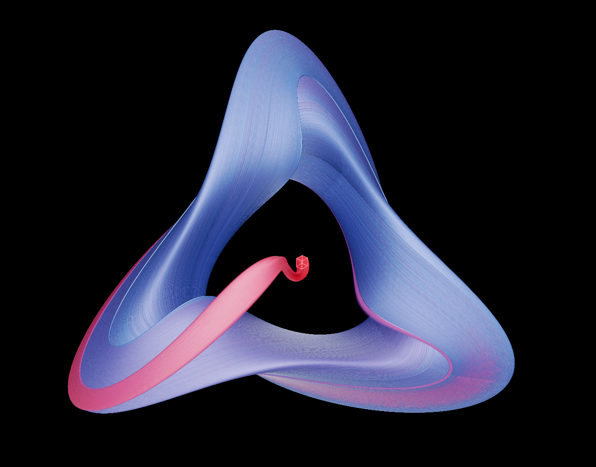</a><a href="https://portsmouth.github.io/fibre/?settings=eyJSIjp7InJheUJhdGNoIjoxMjgsIm1heFRpbWVTdGVwcyI6MjU2LCJtYXhJdGVyYXRpb25zIjoxMDAsImludGVncmF0aW9uVGltZSI6MC4zLCJpbnRlZ3JhdGVGb3J3YXJkIjp0cnVlLCJncmlkU3BhY2UiOjAuMDIsInR1YmVXaWR0aCI6MC4wMTcsInR1YmVTcHJlYWQiOmZhbHNlLCJyZWNvcmRfcmVhbHRpbWUiOnRydWUsInhtaW4iOi0xNC44NDAwNzc2MzA3NTI3NzksInhtYXgiOjAuODcxNDcwMjI4MTg0NTIwNiwieW1pbiI6NTEuNDY3MzIwNjgxMDQ1MiwieW1heCI6NTUuODEzODU4MjUzOTg0MzksInptaW4iOi01LjczODcwNDc3NTE0MjU1NSwiem1heCI6LTQuMzY2MzI4Mzk0NTg1MTk5LCJjbGlwVG9Cb3VuZHMiOmZhbHNlLCJzaG93Qm91bmRzIjp0cnVlLCJleHBvc3VyZSI6LTEsImdhbW1hIjowLjk5MjQ2MTcwMjAwNTY1NjUsImNvbnRyYXN0IjoxLCJzYXR1cmF0aW9uIjoxLjQzNjE1MzcxMzU5NjQxNTUsInN1YnRyYWN0aXZlQ29sb3IiOmZhbHNlLCJiZ0NvbG9yIjpbMCwwLDBdLCJoYWlyU2hhZGVyIjpmYWxzZSwic3BlY1NoaW5lIjo0OC45NzQ2NjgyNzUwMzAxNiwic3BlY0NvbG9yIjpbMC44NzI1NDkwMTk2MDc4NDMxLDAuODcyNTQ5MDE5NjA3ODQzMSwwLjg3MjU0OTAxOTYwNzg0MzFdLCJsaWdodDFfY29sb3IiOlsxLDAuOSwwLjhdLCJsaWdodDJfY29sb3IiOlswLjgsMC45LDFdLCJsaWdodDFfZGlyIjpbMC41NzczNTAyNjkxODk2MjU4LDAuNTc3MzUwMjY5MTg5NjI1OCwwLjU3NzM1MDI2OTE4OTYyNThdLCJsaWdodDJfZGlyIjpbLTAuNTc3MzUwMjY5MTg5NjI1OCwtMC41NzczNTAyNjkxODk2MjU4LC0wLjU3NzM1MDI2OTE4OTYyNThdLCJkZXB0aFRlc3QiOnRydWUsImRhc2hfc3BhY2luZyI6MC41NDAzNDAyNTk5ODA4NTc0LCJkYXNoX3NwZWVkIjozMy4wODIwNTY3MzM1MjE4OSwiZGFzaF9zaXplIjowLjkxNTI3MDIzNjI5NDEwNTUsImRhc2hlcyI6ZmFsc2UsInN1YnRyYWN0aXZlX2NvbG9yIjpmYWxzZSwiaGFpclNoaW5lIjoxMCwiaGFpclNwZWNDb2xvciI6WzEsMSwxXX0sIkMiOnsicG9zIjpbMTA4LjUxNTc3MjkzODYyMzE2LDI5Ljg3ODkzMzc4NDMyMzc1LDgyLjIyNDQ3MDgzODkyNTc0XSwidGFyIjpbLTguMjkwNTQ3Mzg4NDk1MzY0LDEzLjU0Njg5MTk1MjgxNTU1OCwtNS42NTgwNjE0MzY1Nzg1NTFdLCJuZWFyIjowLjAzNDY0MTAxNjE1MTM3NzU1LCJmYXIiOjM0NjQxLjAxNjE1MTM3NzU0Nn0sIkUiOnsiY29kZSI6IlxuLy8vLy8vLy8vLy8vLy8vLy8vLy8vLy8vLy8vLy8vLy8vLy8vLy8vLy8vL1xuLy8gTGl1LUNoZW4gYXR0cmFjdG9yXG4vLy8vLy8vLy8vLy8vLy8vLy8vLy8vLy8vLy8vLy8vLy8vLy8vLy8vLy8vXG5cbmNvbnN0IGZsb2F0IGEgPSBmbG9hdCgtNS44NCk7XG5jb25zdCBmbG9hdCBiID0gZmxvYXQoMC4xKTtcbmNvbnN0IGZsb2F0IGMgPSBmbG9hdCgxNC4wKTtcbmNvbnN0IGZsb2F0IGQgPSBmbG9hdCgtMTYpO1xuY29uc3QgZmxvYXQgZSA9IGZsb2F0KDYpO1xuY29uc3QgZmxvYXQgZiA9IGZsb2F0KDUuMjYpO1xuY29uc3QgZmxvYXQgZyA9IGZsb2F0KC0yLjgpO1xuXG4jZGVmaW5lIHJnYiB2ZWMzXG5cbmNvbnN0IHZlYzMgY29sTG8gPSByZ2IoMjU0LDQ1LDczKSAvIDI1NS4wO1xuY29uc3QgdmVjMyBjb2xIaSA9IHJnYig1LDEzOCwyNTUpIC8gMjU1LjA7XG5jb25zdCBmbG9hdCBtYWdTY2FsZSA9IGZsb2F0KDAuMTIzMik7XG5cbiB2ZWMzIHZlbG9jaXR5KHZlYzMgcCwgZmxvYXQgdClcbiB7XG4gICAgIHZlYzMgdjtcbiAgICAgZmxvYXQgeCA9IHAueDtcbiAgICAgZmxvYXQgeSA9IHAueTtcbiAgICAgZmxvYXQgeiA9IHAuejtcbiAgICAgdi54ID0gYSp5ICsgYip4ICsgYyp5Kno7XG4gICAgIHYueSA9IGQqeSAtIHogKyBlKngqejtcbiAgICAgdi56ID0gZip6ICsgZyp4Knk7XG4gICAgIHJldHVybiB2O1xuIH0gICAgXG4gXG52ZWMzIGNvbG9yKHZlYzMgcCwgZmxvYXQgdClcbntcbiAgICB2ZWMzIHYgPSB2ZWxvY2l0eShwLCB0KTtcbiAgXHRmbG9hdCBtYWcyID0gdC9tYWdTY2FsZTtcbiAgICBmbG9hdCBsZXJwID0gbWFnMi8oMS4wK21hZzIpO1xuICAgIHJldHVybiAoMS4wLWxlcnApKmNvbExvICsgbGVycCpjb2xIaTtcbn0gIFxuIn19">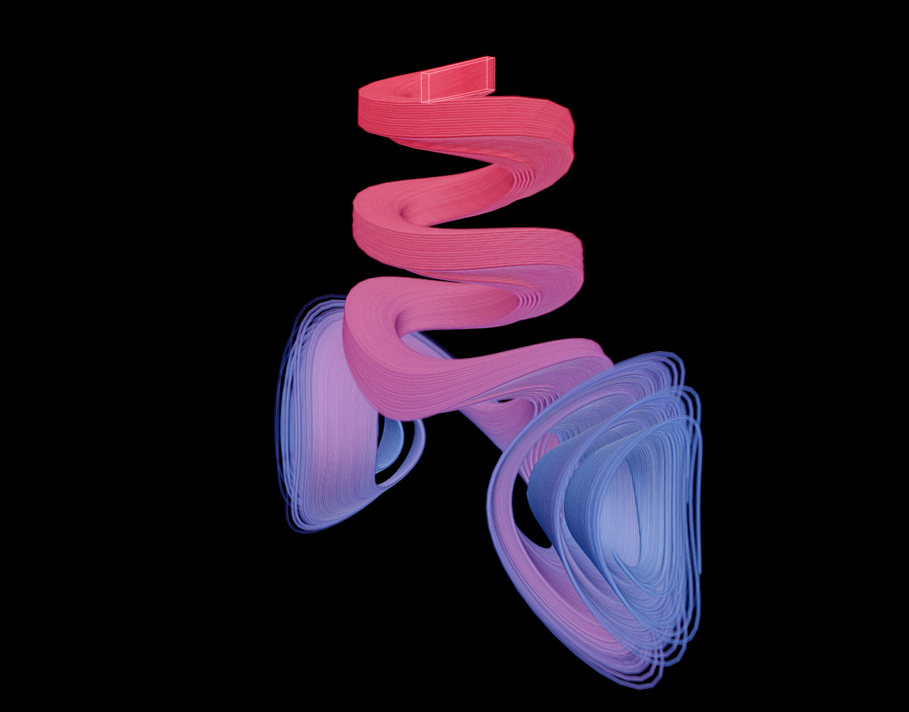</a>
<a href="https://portsmouth.github.io/fibre/?settings=eyJSIjp7InJheUJhdGNoIjoxMjgsIm1heFRpbWVTdGVwcyI6MjI5LCJtYXhJdGVyYXRpb25zIjoxMDAsImludGVncmF0aW9uVGltZSI6MiwiaW50ZWdyYXRlRm9yd2FyZCI6dHJ1ZSwiZ3JpZFNwYWNlIjowLjAzMzA4MjA1NjczMzUyMTgwNCwidHViZVdpZHRoIjowLjAxMzIzMjgyMjY5MzQwODcyMywidHViZVNwcmVhZCI6ZmFsc2UsInJlY29yZF9yZWFsdGltZSI6dHJ1ZSwieG1pbiI6MTguMTI3NTIxNDk3MTg5NjI2LCJ4bWF4IjoyNi43NDEyMjM2ODMyMjY3NzgsInltaW4iOi0xNS4xMDMyMzE2NzQyNjQ5NDUsInltYXgiOi04LjczODI1MzU0Njc5NDE0Mywiem1pbiI6MTkuMjU3MzA2NjExNDgwNjYsInptYXgiOjIxLjU4ODgyMDMyODM4NTQ2MywiY2xpcFRvQm91bmRzIjpmYWxzZSwic2hvd0JvdW5kcyI6dHJ1ZSwiZXhwb3N1cmUiOi0wLjc1MzM5MjIwMzMxNjgyMSwiZ2FtbWEiOjAuOTkyNDYxNzAyMDA1NjU2NSwiY29udHJhc3QiOjEuMTIyMzM0Njk3MzkzOTI2Mywic2F0dXJhdGlvbiI6MS4zODY5OTExNjk1MDI0NzcsInN1YnRyYWN0aXZlQ29sb3IiOmZhbHNlLCJiZ0NvbG9yIjpbMCwwLDBdLCJoYWlyU2hhZGVyIjpmYWxzZSwic3BlY1NoaW5lIjoyMS45NzI4NjIzNzM0NjU0MzIsInNwZWNDb2xvciI6WzAuOTAxOTUzMjc1MDg4MDg4MSwwLjg5MzEwOTkxODYyMzQ5MjEsMC44OTMxMDk5MTg2MjM0OTIxXSwibGlnaHQxX2NvbG9yIjpbMSwwLjksMC44XSwibGlnaHQyX2NvbG9yIjpbMC44LDAuOSwxXSwibGlnaHQxX2RpciI6WzAuNTc3MzUwMjY5MTg5NjI1OCwwLjU3NzM1MDI2OTE4OTYyNTgsMC41NzczNTAyNjkxODk2MjU4XSwibGlnaHQyX2RpciI6Wy0wLjU3NzM1MDI2OTE4OTYyNTgsLTAuNTc3MzUwMjY5MTg5NjI1OCwtMC41NzczNTAyNjkxODk2MjU4XSwiZGVwdGhUZXN0Ijp0cnVlLCJkYXNoX3NwYWNpbmciOjAuNTQwMzQwMjU5OTgwODU3NCwiZGFzaF9zcGVlZCI6MzMuMDgyMDU2NzMzNTIxODksImRhc2hfc2l6ZSI6MC45MTUyNzAyMzYyOTQxMDU1LCJkYXNoZXMiOmZhbHNlLCJzdWJ0cmFjdGl2ZV9jb2xvciI6ZmFsc2UsImhhaXJTaGluZSI6MTAsImhhaXJTcGVjQ29sb3IiOlsxLDEsMV19LCJDIjp7InBvcyI6Wy03LjQyNjkzNjMzNzgzOTcxLC02Ljk5ODI1Mjk3MjIzMzY1OSwxMTcuMTMyNDU3OTg4NDA0MDddLCJ0YXIiOlsxLjE4NTQzMDE1NTUyNDU3NCwtMS4zMzUzOTk3MDQyNDcyNDA1LDI3Ljk0Nzk3NzA0NDE1MDk1N10sIm5lYXIiOjAuMDM0NjQxMDE2MTUxMzc3NTUsImZhciI6MzQ2NDEuMDE2MTUxMzc3NTQ2fSwiRSI6eyJjb2RlIjoiXG4vLy8vLy8vLy8vLy8vLy8vLy8vLy8vLy8vLy8vLy8vLy8vLy8vLy8vLy8vXG4vLyBMb3JlbnogYXR0cmFjdG9yXG4vLy8vLy8vLy8vLy8vLy8vLy8vLy8vLy8vLy8vLy8vLy8vLy8vLy8vLy8vXG5cbmNvbnN0IGZsb2F0IGthcHBhID0gZmxvYXQoMS44NCk7XG5jb25zdCBmbG9hdCBhbHBoYSA9IGZsb2F0KDYuNyk7XG5cbiNkZWZpbmUgcmdiIHZlYzNcblxuY29uc3QgdmVjMyBjb2xMbyA9IHJnYigyNTQsNDUsNzMpIC8gMjU1LjA7XG5jb25zdCB2ZWMzIGNvbEhpID0gcmdiKDUsMTM4LDI1NSkgLyAyNTUuMDtcbmNvbnN0IGZsb2F0IG1hZ1NjYWxlID0gZmxvYXQoMC42KTtcblxuY29uc3QgZmxvYXQgcmhvICAgPSBmbG9hdCgyOC4wKTsgICAgIFxuY29uc3QgZmxvYXQgc2lnbWEgPSBmbG9hdCgxMC4wKTtcbmNvbnN0IGZsb2F0IGJldGEgID0gZmxvYXQoOC4wKS9mbG9hdCgzLjApO1xuXG5cbiB2ZWMzIHZlbG9jaXR5KHZlYzMgcCwgZmxvYXQgdClcbiB7XG4gICAgIHZlYzMgdjtcbiAgICAgZmxvYXQgeCA9IHAueDtcbiAgICAgZmxvYXQgeSA9IHAueTtcbiAgICAgZmxvYXQgeiA9IHAuejtcbiAgICAgdi54ID0gc2lnbWEqKHkgLSB4KTtcbiAgICAgdi55ID0geCoocmhvIC0geik7XG4gICAgIHYueiA9IHgqeSAtIGJldGEqejtcbiAgICAgcmV0dXJuIHY7XG4gfSAgICBcbiBcbiBcbnZlYzMgY29sb3IodmVjMyBwLCBmbG9hdCB0KVxue1xuICAgIHZlYzMgdiA9IHZlbG9jaXR5KHAsIHQpO1xuICBcdGZsb2F0IG1hZzIgPSB0L21hZ1NjYWxlO1xuICAgIGZsb2F0IGxlcnAgPSBtYWcyLygxLjArbWFnMik7XG4gICAgcmV0dXJuICgxLjAtbGVycCkqY29sTG8gKyBsZXJwKmNvbEhpO1xufSAgXG4ifX0%3D">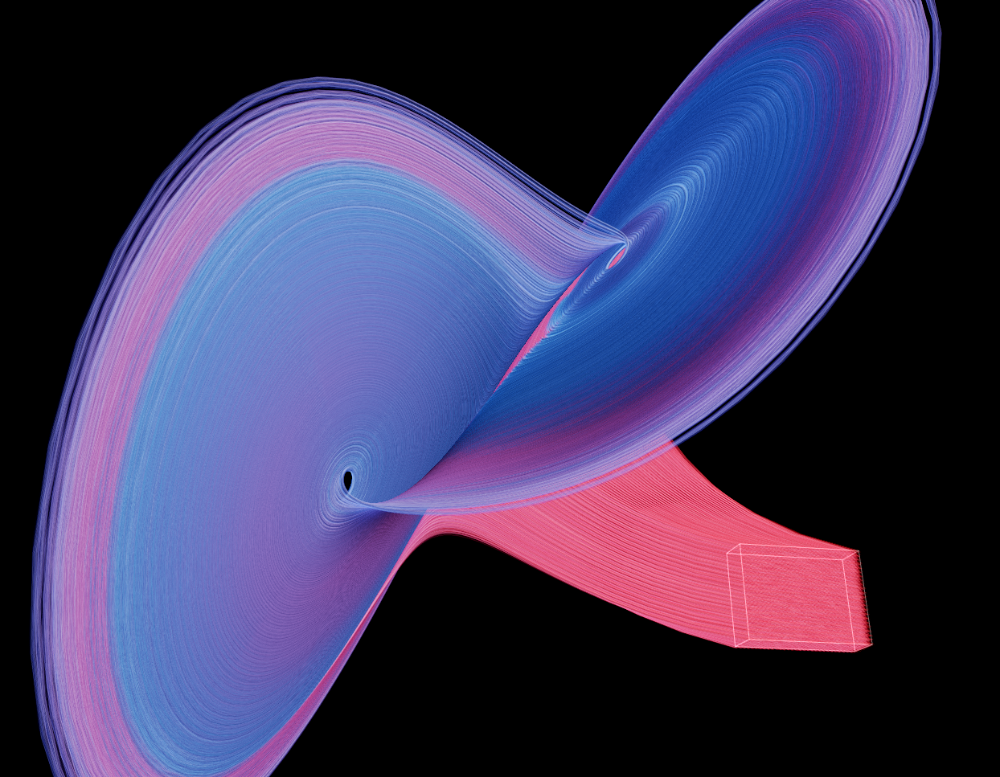</a><a href="https://portsmouth.github.io/fibre/?settings=eyJSIjp7InJheUJhdGNoIjoxMjgsIm1heFRpbWVTdGVwcyI6MjU2LCJtYXhJdGVyYXRpb25zIjoxMDAsImludGVncmF0aW9uVGltZSI6MjAsImludGVncmF0ZUZvcndhcmQiOnRydWUsImdyaWRTcGFjZSI6MC4wMiwidHViZVdpZHRoIjowLjAxNywidHViZVNwcmVhZCI6ZmFsc2UsInJlY29yZF9yZWFsdGltZSI6dHJ1ZSwieG1pbiI6MC4wMjI2OTkxODIwNDY3ODU1NiwieG1heCI6MC4zNDQ2NTIwMzQ5NzY1MTQyLCJ5bWluIjotMC4xNTcwMDg1MTgwMTU4MzAxNiwieW1heCI6LTAuMTM5NjYxNjc2MDYyOTE3NjMsInptaW4iOi0wLjA3NjQwODQwMzAxNzU2MDI0LCJ6bWF4IjowLjEwOTUzMzYzOTQ3MzY2NjAxLCJjbGlwVG9Cb3VuZHMiOmZhbHNlLCJzaG93Qm91bmRzIjp0cnVlLCJleHBvc3VyZSI6LTEsImdhbW1hIjowLjk5MjQ2MTcwMjAwNTY1NjUsImNvbnRyYXN0IjoxLCJzYXR1cmF0aW9uIjoxLjI1NDY2MjkzMzQ0ODIwMTYsInN1YnRyYWN0aXZlQ29sb3IiOmZhbHNlLCJiZ0NvbG9yIjpbMCwwLDBdLCJoYWlyU2hhZGVyIjpmYWxzZSwic3BlY1NoaW5lIjozNC4xMDI5NTA2Nzg0NDA2Niwic3BlY0NvbG9yIjpbMC42NDU1MzgxMDgwMDQ1OTU5LDAuNjQ1NTM4MTA4MDA0NTk1OSwwLjY0NTUzODEwODAwNDU5NTldLCJsaWdodDFfY29sb3IiOlsxLDAuOSwwLjhdLCJsaWdodDJfY29sb3IiOlswLjgsMC45LDFdLCJsaWdodDFfZGlyIjpbMC41NzczNTAyNjkxODk2MjU4LDAuNTc3MzUwMjY5MTg5NjI1OCwwLjU3NzM1MDI2OTE4OTYyNThdLCJsaWdodDJfZGlyIjpbLTAuNTc3MzUwMjY5MTg5NjI1OCwtMC41NzczNTAyNjkxODk2MjU4LC0wLjU3NzM1MDI2OTE4OTYyNThdLCJkZXB0aFRlc3QiOnRydWUsImRhc2hfc3BhY2luZyI6MC41NDAzNDAyNTk5ODA4NTc0LCJkYXNoX3NwZWVkIjozMy4wODIwNTY3MzM1MjE4OSwiZGFzaF9zaXplIjowLjkxNTI3MDIzNjI5NDEwNTUsImRhc2hlcyI6ZmFsc2UsInN1YnRyYWN0aXZlX2NvbG9yIjpmYWxzZSwiaGFpclNoaW5lIjoxMCwiaGFpclNwZWNDb2xvciI6WzEsMSwxXX0sIkMiOnsicG9zIjpbMS4xNjQ2NzA2OTQxMzk0Mjg1LDAuNDc0OTA3NTQzNDQ0OTE4NSwtMC42ODk1ODIxNzY3MjcxMTI0XSwidGFyIjpbMC4yMTI3MzMyMzAzOTc3NjA5LC0wLjAyMjcwMTcxMDUyNjg1MDczLDAuMDY3MTI3NDk5NDk3NTA2NjRdLCJuZWFyIjowLjAzNDY0MTAxNjE1MTM3NzU1LCJmYXIiOjM0NjQxLjAxNjE1MTM3NzU0Nn0sIkUiOnsiY29kZSI6IlxuLy8vLy8vLy8vLy8vLy8vLy8vLy8vLy8vLy8vLy8vLy8vLy8vLy8vLy8vL1xuLy8gTmV3dG9uLUxlaXBuaWsgYXR0cmFjdG9yXG4vLy8vLy8vLy8vLy8vLy8vLy8vLy8vLy8vLy8vLy8vLy8vLy8vLy8vLy8vXG5cbmNvbnN0IGZsb2F0IGEgPSBmbG9hdCgwLjQpO1xuY29uc3QgZmxvYXQgYiA9IGZsb2F0KDAuMTc1KTtcblxuI2RlZmluZSByZ2IgdmVjM1xuXG5jb25zdCB2ZWMzIGNvbExvID0gcmdiKDI1NCw0NSw3MykgLyAyNTUuMDtcbmNvbnN0IHZlYzMgY29sSGkgPSByZ2IoMCw4NywyMzkpIC8gMjU1LjA7XG5jb25zdCBmbG9hdCBtYWdTY2FsZSA9IGZsb2F0KDUpO1xuXG52ZWMzIHZlbG9jaXR5KHZlYzMgcCwgZmxvYXQgdClcbntcbiAgICB2ZWMzIHY7XG4gICAgZmxvYXQgeCA9IHAueDtcbiAgICBmbG9hdCB5ID0gcC55O1xuICAgIGZsb2F0IHogPSBwLno7XG4gICAgdi54ID0gLWEqeCArIHkgKyAxMC4wKnkqejtcbiAgICB2LnkgPSAteCAtIDAuNCp5ICsgNS4wKngqejtcbiAgICB2LnogPSBiKnogLSA1LjAqeCp5O1xuICAgIHJldHVybiB2O1xufSAgICBcbiBcbnZlYzMgY29sb3IodmVjMyBwLCBmbG9hdCB0KVxue1xuICAgIHZlYzMgdiA9IHZlbG9jaXR5KHAsIHQpO1xuICBcdGZsb2F0IG1hZzIgPSB0L21hZ1NjYWxlO1xuICAgIGZsb2F0IGxlcnAgPSBtYWcyLygxLjArbWFnMik7XG4gICAgcmV0dXJuICgxLjAtbGVycCkqY29sTG8gKyBsZXJwKmNvbEhpO1xufSAgXG4ifX0%3D">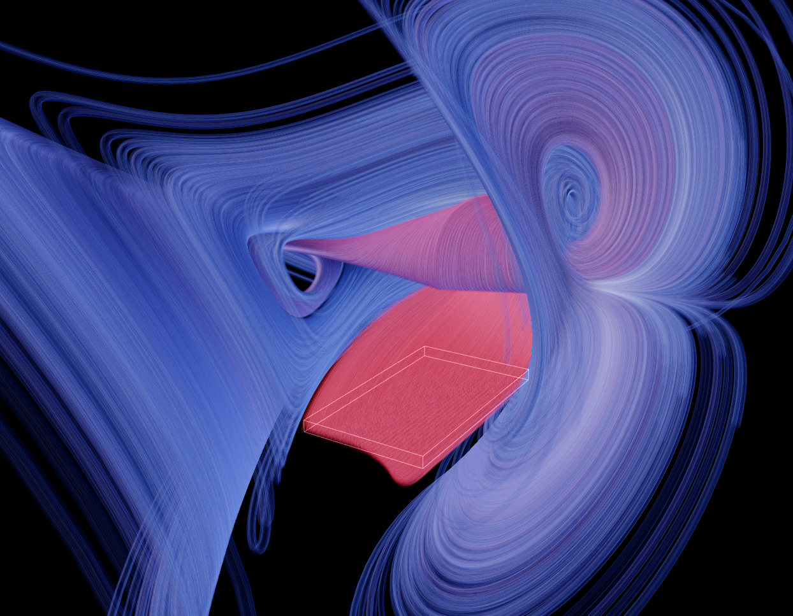</a><a href="https://portsmouth.github.io/fibre/?settings=eyJSIjp7InJheUJhdGNoIjoxMjgsIm1heFRpbWVTdGVwcyI6MjU2LCJtYXhJdGVyYXRpb25zIjoxMDAsImludGVncmF0aW9uVGltZSI6MjUsImludGVncmF0ZUZvcndhcmQiOnRydWUsImdyaWRTcGFjZSI6MC4wMzMwODIwNTY3MzM1MjE4MDQsInR1YmVXaWR0aCI6MC4wMTMyMzI4MjI2OTM0MDg3MjMsInR1YmVTcHJlYWQiOmZhbHNlLCJyZWNvcmRfcmVhbHRpbWUiOnRydWUsInhtaW4iOi0wLjc4MjkxNjIzNjMzNzI0NSwieG1heCI6MC4wNjU1NTUzNTA0MTgxOTE2LCJ5bWluIjotMC4xMzQwNjYwNDYxOTk1MDAwMiwieW1heCI6Mi4wNzgyMjg0MDE5ODY0NDk2LCJ6bWluIjotNC4xNTk4MDYxODM5MzA3MDIsInptYXgiOi0zLjE1OTgwNjE4MzkzMDcwMjMsImNsaXBUb0JvdW5kcyI6ZmFsc2UsInNob3dCb3VuZHMiOnRydWUsImV4cG9zdXJlIjotMSwiZ2FtbWEiOjAuOTkyNDYxNzAyMDA1NjU2NSwiY29udHJhc3QiOjEuMDU4NzAxNzAwODcwNDUyNywic2F0dXJhdGlvbiI6MS40MjAwNzMyMjg1MTYwNDU2LCJzdWJ0cmFjdGl2ZUNvbG9yIjpmYWxzZSwiYmdDb2xvciI6WzAsMCwwXSwiaGFpclNoYWRlciI6ZmFsc2UsInNwZWNTaGluZSI6MjQuMTc4MzMyOTc0MzcwMDIyLCJzcGVjQ29sb3IiOlswLjkwMTk1MzI3NTA4ODA4ODEsMC44OTMxMDk5MTg2MjM0OTIxLDAuODkzMTA5OTE4NjIzNDkyMV0sImxpZ2h0MV9jb2xvciI6WzEsMC45LDAuOF0sImxpZ2h0Ml9jb2xvciI6WzAuOCwwLjksMV0sImxpZ2h0MV9kaXIiOlswLjU3NzM1MDI2OTE4OTYyNTgsMC41NzczNTAyNjkxODk2MjU4LDAuNTc3MzUwMjY5MTg5NjI1OF0sImxpZ2h0Ml9kaXIiOlstMC41NzczNTAyNjkxODk2MjU4LC0wLjU3NzM1MDI2OTE4OTYyNTgsLTAuNTc3MzUwMjY5MTg5NjI1OF0sImRlcHRoVGVzdCI6dHJ1ZSwiZGFzaF9zcGFjaW5nIjowLjU0MDM0MDI1OTk4MDg1NzQsImRhc2hfc3BlZWQiOjMzLjA4MjA1NjczMzUyMTg5LCJkYXNoX3NpemUiOjAuOTE1MjcwMjM2Mjk0MTA1NSwiZGFzaGVzIjpmYWxzZSwic3VidHJhY3RpdmVfY29sb3IiOmZhbHNlLCJoYWlyU2hpbmUiOjEwLCJoYWlyU3BlY0NvbG9yIjpbMSwxLDFdfSwiQyI6eyJwb3MiOls2LjQ4NzIzNzg3MzQ1MDM1OTUsMC42ODc3OTQyODI1NjY0OTcyLDcuMTU0NjA1NTAwOTU2OTUxXSwidGFyIjpbLTAuMTE1ODc0MjM4MjcwMTg5MywtMC4wOTMzMzI4MjM4MDIwNjE2NSwtMC44NTg2NTczMDE2MzM2MTE5XSwibmVhciI6MC4wMzQ2NDEwMTYxNTEzNzc1NSwiZmFyIjozNDY0MS4wMTYxNTEzNzc1NDZ9LCJFIjp7ImNvZGUiOiJcbi8vLy8vLy8vLy8vLy8vLy8vLy8vLy8vLy8vLy8vLy8vLy8vLy8vLy8vLy9cbi8vIE5vc2UtSG9vdmVyIGF0dHJhY3RvclxuLy8vLy8vLy8vLy8vLy8vLy8vLy8vLy8vLy8vLy8vLy8vLy8vLy8vLy8vL1xuXG5jb25zdCBmbG9hdCBhID0gZmxvYXQoMC43NSk7XG5cbiNkZWZpbmUgcmdiIHZlYzNcblxuY29uc3QgdmVjMyBjb2xMbyA9IHJnYigyNTQsNDUsNzMpIC8gMjU1LjA7XG5jb25zdCB2ZWMzIGNvbEhpID0gcmdiKDUsMTM4LDI1NSkgLyAyNTUuMDtcbmNvbnN0IGZsb2F0IG1hZ1NjYWxlID0gZmxvYXQoNi44KTtcblxudmVjMyB2ZWxvY2l0eSh2ZWMzIHAsIGZsb2F0IHQpXG57XG4gICAgdmVjMyB2O1xuICAgIGZsb2F0IHggPSBwLng7XG4gICAgZmxvYXQgeSA9IHAueTtcbiAgICBmbG9hdCB6ID0gcC56O1xuICAgIHYueCA9IHk7XG4gICAgdi55ID0gLXggKyB5Kno7XG4gICAgdi56ID0gYSAtIHkqeTtcbiAgICByZXR1cm4gdjtcbn0gICAgXG4gXG4gXG52ZWMzIGNvbG9yKHZlYzMgcCwgZmxvYXQgdClcbntcbiAgICB2ZWMzIHYgPSB2ZWxvY2l0eShwLCB0KTtcbiAgXHRmbG9hdCBtYWcyID0gdC9tYWdTY2FsZTtcbiAgICBmbG9hdCBsZXJwID0gbWFnMi8oMS4wK21hZzIpO1xuICAgIHJldHVybiAoMS4wLWxlcnApKmNvbExvICsgbGVycCpjb2xIaTtcbn0gIFxuIn19">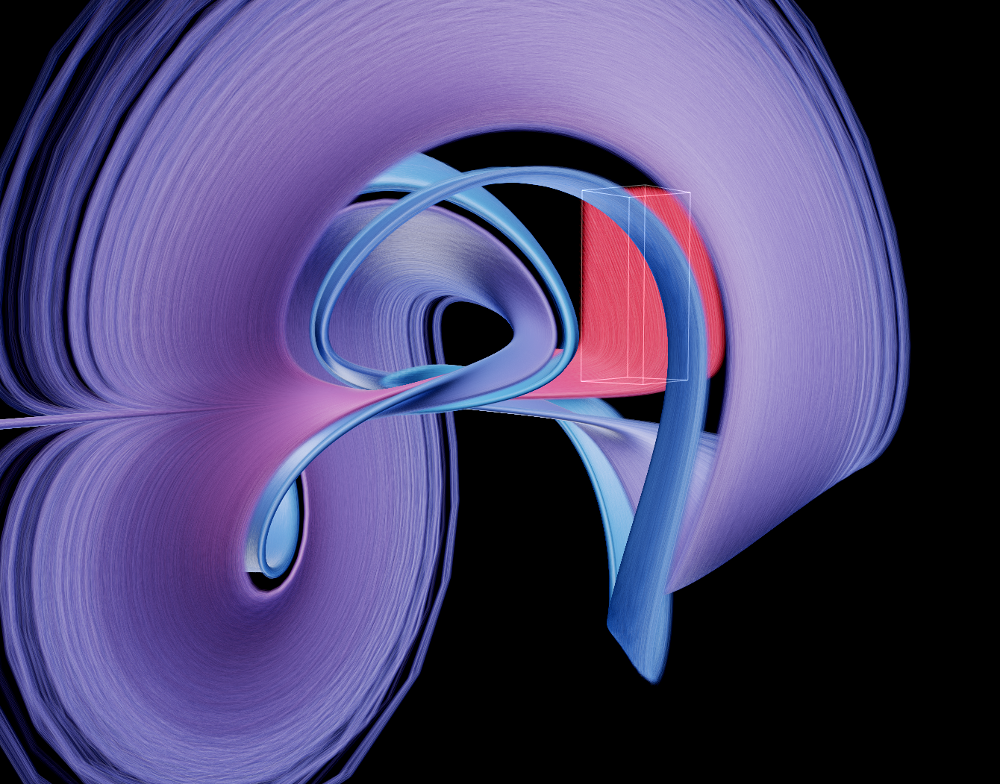</a><a href="https://portsmouth.github.io/fibre/?settings=eyJSIjp7InJheUJhdGNoIjoxMjgsIm1heFRpbWVTdGVwcyI6MTI4LCJtYXhJdGVyYXRpb25zIjoxMDAsImludGVncmF0aW9uVGltZSI6MTAsImludGVncmF0ZUZvcndhcmQiOmZhbHNlLCJncmlkU3BhY2UiOjAuMDg3NDAwMzg3NjgwMzc5MDcsInR1YmVXaWR0aCI6MC4wMDMyMjYzNjIyNjU3NzY0Mzc3LCJ0dWJlU3ByZWFkIjpmYWxzZSwicmVjb3JkX3JlYWx0aW1lIjp0cnVlLCJ4bWluIjotMC45NjY5MTM3MDM1NTU4MTY5LCJ4bWF4IjoxLjAzMzA4NjI5NjQ0NDE4MzQsInltaW4iOi0wLjgzOTc5ODEzMTMxODQxMTYsInltYXgiOjEuMDk4MzI3NzAyOTU4ODc3OCwiem1pbiI6LTAuODUxNzA3MzMyNDY5NTU0NSwiem1heCI6MC44OTA2NjQyODA4MTYzMTI4LCJjbGlwVG9Cb3VuZHMiOmZhbHNlLCJzaG93Qm91bmRzIjp0cnVlLCJleHBvc3VyZSI6LTAuNTMyODQ1MTQzMjI2MzYyMywiZ2FtbWEiOjIuMiwiY29udHJhc3QiOjEuMTkxMDM5NDEzNDc5MjU5Miwic2F0dXJhdGlvbiI6MS42NTE2NDc2NDE2MTEwMjc1LCJzdWJ0cmFjdGl2ZUNvbG9yIjpmYWxzZSwiYmdDb2xvciI6WzAsMCwwXSwiaGFpclNoYWRlciI6ZmFsc2UsInNwZWNTaGluZSI6MTUuMzU2NDUwNTcwNzUxNjcsInNwZWNDb2xvciI6WzAuNTM2MDc4MTMwOTg0Mjk3MiwwLjUzNjA3ODEzMDk4NDI5NzIsMC41MzYwNzgxMzA5ODQyOTcyXSwibGlnaHQxX2NvbG9yIjpbMSwwLjksMC44XSwibGlnaHQyX2NvbG9yIjpbMC44LDAuOSwxXSwibGlnaHQxX2RpciI6WzAuNTc3MzUwMjY5MTg5NjI1OCwwLjU3NzM1MDI2OTE4OTYyNTgsMC41NzczNTAyNjkxODk2MjU4XSwibGlnaHQyX2RpciI6Wy0wLjU3NzM1MDI2OTE4OTYyNTgsLTAuNTc3MzUwMjY5MTg5NjI1OCwtMC41NzczNTAyNjkxODk2MjU4XSwiZGVwdGhUZXN0Ijp0cnVlLCJkYXNoX3NwYWNpbmciOjAuMzMwODYzMjU1MzE5NDUzOCwiZGFzaF9zcGVlZCI6MTEuMDI4Nzc1MTc3MzE1MTI3LCJkYXNoX3NpemUiOjAuNzcyMDE0MjYyNDEyMDU4OCwiZGFzaGVzIjpmYWxzZSwic3VidHJhY3RpdmVfY29sb3IiOmZhbHNlLCJoYWlyU2hpbmUiOjEwLCJoYWlyU3BlY0NvbG9yIjpbMSwxLDFdfSwiQyI6eyJwb3MiOlstMC41OTg5NTI5NDAyMTE4MTY0LDAuNTA3MjkwMzg0MjM3Njg1NiwtNi4xNjIyMTU2ODc3NjgzODhdLCJ0YXIiOlswLjAzNzMyODEwNjgyMTU5NDU4NCwtMC4wMDM1NjYyNzAxMDg0MDM3MTk1LDAuMDM0MTQzNDk2NDEyMjU5MDFdLCJuZWFyIjowLjAzNDY0MTAxNjE1MTM3NzU1LCJmYXIiOjM0NjQxLjAxNjE1MTM3NzU0Nn0sIkUiOnsiY29kZSI6Ii8vLy8vLy8vLy8vLy8vLy8vLy8vLy8vLy8vLy8vLy8vLy8vLy8vLy8vLy9cbi8vIFF1YWRydXBvbGUgZmllbGRcbi8vLy8vLy8vLy8vLy8vLy8vLy8vLy8vLy8vLy8vLy8vLy8vLy8vLy8vLy9cblxuI2RlZmluZSByZ2IgdmVjM1xuXG5jb25zdCB2ZWMzIGNvbExvID0gcmdiKDAsMjAsMjA5KSAvIDI1NS4wO1xuY29uc3QgdmVjMyBjb2xIaSA9IHJnYigyNTUsNDcsMjApIC8gMjU1LjA7XG5jb25zdCBmbG9hdCBtYWdTY2FsZSA9IGZsb2F0KDUuMCk7XG5cbmNvbnN0IGZsb2F0IHExID0gMS4wO1xuY29uc3QgZmxvYXQgcTIgPSAxLjA7XG5jb25zdCBmbG9hdCBxMyA9IC0xLjA7XG5jb25zdCBmbG9hdCBxNCA9IC0xLjA7XG5cbnZlYzMgRShmbG9hdCBxLCBpbiB2ZWMzIHAsIHZlYzMgYylcbntcbiAgICB2ZWMzIHBjID0gcCAtIGM7XG4gICAgZmxvYXQgcjIgPSBkb3QocGMsIHBjKTtcbiAgICB2ZWMzIEUgPSBxICogKHAtYykgLyAocG93KHIyLCAxLjUpICsgMS4wZS0yKTtcbiAgICByZXR1cm4gRTtcbn1cblxudmVjMyB2ZWxvY2l0eSh2ZWMzIHAsIGZsb2F0IHQpXG57XG4gICAgdmVjMyB4MSA9IHZlYzMoMCwgIDAuNSwgMCk7XG4gICAgdmVjMyB4MiA9IHZlYzMoMCwgLTAuNSwgMCk7XG4gIFx0dmVjMyB4MyA9IHZlYzMoMC41LCAgMCwgMCk7XG4gICAgdmVjMyB4NCA9IHZlYzMoLTAuNSwgMCwgMCk7XG4gICAgcmV0dXJuICBFKHExLCBwLCB4MSkgKyBFKHEyLCBwLCB4MilcbiAgICAgICAgICArIEUocTMsIHAsIHgzKSArIEUocTQsIHAsIHg0KTtcbn0gICAgXG5cbnZlYzMgY29sb3IodmVjMyBwLCBmbG9hdCB0KVxue1xuICAgIHZlYzMgRSA9IHZlbG9jaXR5KHAsIHQpO1xuICBcdGZsb2F0IG1hZzIgPSBkb3QoRSxFKSAvIChtYWdTY2FsZSptYWdTY2FsZSk7XG4gICAgZmxvYXQgbGVycCA9IG1hZzIvKDEuMCttYWcyKTtcbiAgICByZXR1cm4gKDEuMC1sZXJwKSpjb2xMbyArIGxlcnAqY29sSGk7XG59ICBcbiJ9fQ%3D%3D">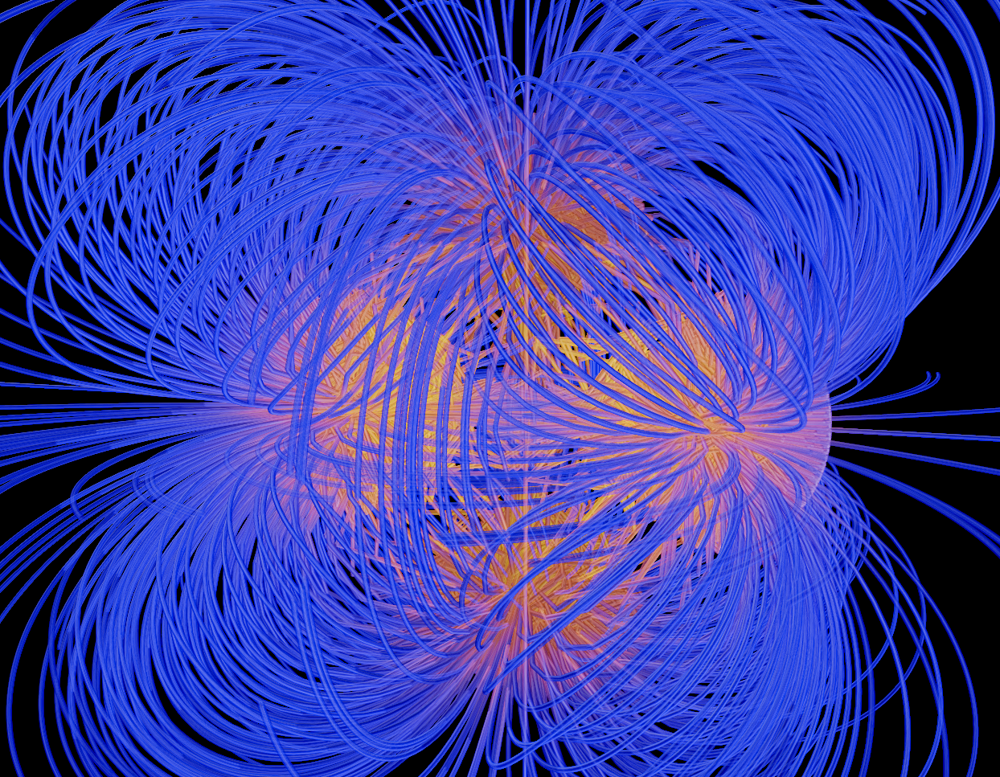</a>
<a href="https://portsmouth.github.io/fibre/?settings=eyJSIjp7InJheUJhdGNoIjoxMjgsIm1heFRpbWVTdGVwcyI6MjU2LCJtYXhJdGVyYXRpb25zIjoxMDAsImludGVncmF0aW9uVGltZSI6OSwiaW50ZWdyYXRlRm9yd2FyZCI6dHJ1ZSwiZ3JpZFNwYWNlIjowLjAwNSwidHViZVdpZHRoIjowLjAwNDg1OTU1NTQwMjM3ODA4LCJ0dWJlU3ByZWFkIjpmYWxzZSwicmVjb3JkX3JlYWx0aW1lIjp0cnVlLCJ4bWluIjotMS4wMjgxNjc4MjMzNDEzMTE0LCJ4bWF4IjoxLjcwOTAxMTA0NjMyNDYwNjcsInltaW4iOi0xOS45MDA4NzMzNDYwODY4NCwieW1heCI6MjAuNjAyNDU1MDkzNjIwNCwiem1pbiI6MzQuODQ1OTI5NTA1MTkwODk1LCJ6bWF4IjozNS4yODg2Mzg4MTU0ODI2ODUsImNsaXBUb0JvdW5kcyI6ZmFsc2UsInNob3dCb3VuZHMiOnRydWUsImV4cG9zdXJlIjotMSwiZ2FtbWEiOjAuOTkyNDYxNzAyMDA1NjU2NSwiY29udHJhc3QiOjEsInNhdHVyYXRpb24iOjEuMjcwNzIyMDQwMzIzOTcwMywic3VidHJhY3RpdmVDb2xvciI6ZmFsc2UsImJnQ29sb3IiOlswLDAsMF0sImhhaXJTaGFkZXIiOmZhbHNlLCJzcGVjU2hpbmUiOjM1Ljc0MDEzNDQxMzIzNDUzLCJzcGVjQ29sb3IiOlswLjc1NDkwMTk2MDc4NDMxMzcsMC43NTQ5MDE5NjA3ODQzMTM3LDAuNzU0OTAxOTYwNzg0MzEzN10sImxpZ2h0MV9jb2xvciI6WzEsMC45LDAuOF0sImxpZ2h0Ml9jb2xvciI6WzAuOCwwLjksMV0sImxpZ2h0MV9kaXIiOlswLjU3NzM1MDI2OTE4OTYyNTgsMC41NzczNTAyNjkxODk2MjU4LDAuNTc3MzUwMjY5MTg5NjI1OF0sImxpZ2h0Ml9kaXIiOlstMC41NzczNTAyNjkxODk2MjU4LC0wLjU3NzM1MDI2OTE4OTYyNTgsLTAuNTc3MzUwMjY5MTg5NjI1OF0sImRlcHRoVGVzdCI6dHJ1ZSwiZGFzaF9zcGFjaW5nIjowLjAwNCwiZGFzaF9zcGVlZCI6OCwiZGFzaF9zaXplIjowLjQxMjU0NTIzNTIyMzE2MDQ0LCJkYXNoZXMiOmZhbHNlLCJzdWJ0cmFjdGl2ZV9jb2xvciI6ZmFsc2UsImhhaXJTaGluZSI6MTAsImhhaXJTcGVjQ29sb3IiOlsxLDEsMV19LCJDIjp7InBvcyI6Wy0xNy40MDQ2Mzk5NTY4MzQ3OCwtMzYuOTA5OTQ3MTEyMjA1Nzg1LDEzMy41MzA2ODk4MTIyOTkxXSwidGFyIjpbNS4yMTQ5NzY4NTc0MjQ0NjEsMS42OTUxOTE3MjM0ODE0NzQsMTkuNjQ2ODE5OTA0NjMxNDNdLCJuZWFyIjowLjAzNDY0MTAxNjE1MTM3NzU1LCJmYXIiOjM0NjQxLjAxNjE1MTM3NzU0Nn0sIkUiOnsiY29kZSI6IlxuLy8vLy8vLy8vLy8vLy8vLy8vLy8vLy8vLy8vLy8vLy8vLy8vLy8vLy8vL1xuLy8gUmF5bGVpZ2gtQmVuYXJkIGF0dHJhY3RvclxuLy8vLy8vLy8vLy8vLy8vLy8vLy8vLy8vLy8vLy8vLy8vLy8vLy8vLy8vL1xuXG5jb25zdCBmbG9hdCBhID0gZmxvYXQoOSk7XG5jb25zdCBmbG9hdCByID0gZmxvYXQoMzQpO1xuY29uc3QgZmxvYXQgYiA9IGZsb2F0KDUuMCk7XG5cbiNkZWZpbmUgcmdiIHZlYzNcblxuY29uc3QgdmVjMyBjb2xMbyA9IHJnYigyNTQsNDUsNzMpIC8gMjU1LjA7XG5jb25zdCB2ZWMzIGNvbEhpID0gcmdiKDUsMTM4LDI1NSkgLyAyNTUuMDtcbmNvbnN0IGZsb2F0IG1hZ1NjYWxlID0gZmxvYXQoMC41OTkwNCk7XG5cbiB2ZWMzIHZlbG9jaXR5KHZlYzMgcCwgZmxvYXQgdClcbiB7XG4gICAgIHZlYzMgdjtcbiAgICAgZmxvYXQgeCA9IHAueDtcbiAgICAgZmxvYXQgeSA9IHAueTtcbiAgICAgZmxvYXQgeiA9IHAuejtcbiAgICAgdi54ID0gLWEqKHggLSB5KTtcbiAgICAgdi55ID0gcip4IC0geSAtIHgqejtcbiAgICAgdi56ID0geCp5IC0gYip6O1xuICAgICByZXR1cm4gdjtcbiB9ICAgIFxuIFxudmVjMyBjb2xvcih2ZWMzIHAsIGZsb2F0IHQpXG57XG4gICAgdmVjMyB2ID0gdmVsb2NpdHkocCwgdCk7XG4gIFx0ZmxvYXQgbWFnMiA9IHQvbWFnU2NhbGU7XG4gICAgZmxvYXQgbGVycCA9IG1hZzIvKDEuMCttYWcyKTtcbiAgICByZXR1cm4gKDEuMC1sZXJwKSpjb2xMbyArIGxlcnAqY29sSGk7XG59ICBcbiJ9fQ%3D%3D">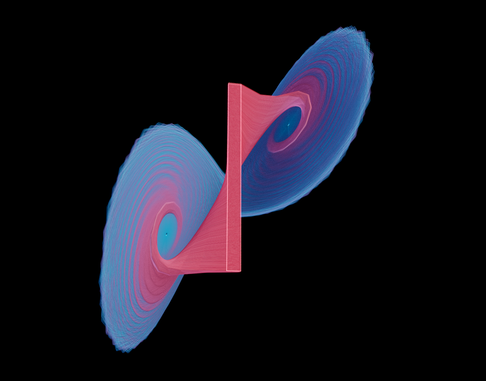</a><a href="https://portsmouth.github.io/fibre/?settings=eyJSIjp7InJheUJhdGNoIjoxMjgsIm1heFRpbWVTdGVwcyI6MzAwLCJtYXhJdGVyYXRpb25zIjoxMDAsImludGVncmF0aW9uVGltZSI6MjAsImludGVncmF0ZUZvcndhcmQiOnRydWUsImdyaWRTcGFjZSI6MC4wMDQsInR1YmVXaWR0aCI6MC4wMTUzNTY0NTA1NzA3NTE2NywidHViZVNwcmVhZCI6ZmFsc2UsInJlY29yZF9yZWFsdGltZSI6dHJ1ZSwieG1pbiI6LTUuODYyNDcxOTk2OTQzOTI4NSwieG1heCI6LTIuNTUyMzY2MTk3NDQyNjI2LCJ5bWluIjowLjI4NTU3MTY1NjcyNDE3MTMsInltYXgiOjEuNDk1MTUxMTU1MTY4NTg2OCwiem1pbiI6LTYuNTI0NjQxNTMzMTY2ODcxNSwiem1heCI6LTUuNTc5NzMyMTg1MzYyNTg0LCJjbGlwVG9Cb3VuZHMiOmZhbHNlLCJzaG93Qm91bmRzIjp0cnVlLCJleHBvc3VyZSI6LTEuODM5MTc0Mzg5MTIzNTkzNywiZ2FtbWEiOjEuMDI1NjE3MjcyNzE4MjUxLCJjb250cmFzdCI6MS4yOTAyOTI2OTc5MzU4NjQyLCJzYXR1cmF0aW9uIjoxLjI4Nzc0NDk5MjQ2MTc3MDUsInN1YnRyYWN0aXZlQ29sb3IiOmZhbHNlLCJiZ0NvbG9yIjpbMCwwLDBdLCJoYWlyU2hhZGVyIjpmYWxzZSwic3BlY1NoaW5lIjoyMC44NzAxMjcwNzMwMTMxNCwic3BlY0NvbG9yIjpbMSwxLDFdLCJsaWdodDFfY29sb3IiOlsxLDAuOSwwLjhdLCJsaWdodDJfY29sb3IiOlswLjgsMC45LDFdLCJsaWdodDFfZGlyIjpbMC41NzczNTAyNjkxODk2MjU4LDAuNTc3MzUwMjY5MTg5NjI1OCwwLjU3NzM1MDI2OTE4OTYyNThdLCJsaWdodDJfZGlyIjpbLTAuNTc3MzUwMjY5MTg5NjI1OCwtMC41NzczNTAyNjkxODk2MjU4LC0wLjU3NzM1MDI2OTE4OTYyNThdLCJkZXB0aFRlc3QiOnRydWUsImRhc2hfc3BhY2luZyI6MC41NDAzNDAyNTk5ODA4NTc0LCJkYXNoX3NwZWVkIjozMy4wODIwNTY3MzM1MjE4OSwiZGFzaF9zaXplIjowLjkxNTI3MDIzNjI5NDEwNTUsImRhc2hlcyI6ZmFsc2UsInN1YnRyYWN0aXZlX2NvbG9yIjpmYWxzZSwiaGFpclNoaW5lIjoxMCwiaGFpclNwZWNDb2xvciI6WzEsMSwxXX0sIkMiOnsicG9zIjpbMi42MjUwNTk4NTYyMTY5NzM2LC00NC44OTk5NzA3NDA3MjE1MywxNC4xNTU4MDI2MjU5NTk3MTJdLCJ0YXIiOlsyLjQ1ODcwOTI5NTI2NjA3Niw2LjI3MzM1MzMyNDU1MjExMyw3LjM1MTYyNjAxMDgzMjgyNF0sIm5lYXIiOjAuMDM0NjQxMDE2MTUxMzc3NTUsImZhciI6MzQ2NDEuMDE2MTUxMzc3NTQ2fSwiRSI6eyJjb2RlIjoiXG4vLy8vLy8vLy8vLy8vLy8vLy8vLy8vLy8vLy8vLy8vLy8vLy8vLy8vLy8vXG4vLyBSb3NzbGVyIGF0dHJhY3RvclxuLy8vLy8vLy8vLy8vLy8vLy8vLy8vLy8vLy8vLy8vLy8vLy8vLy8vLy8vL1xuXG5jb25zdCBmbG9hdCBhID0gZmxvYXQoMC4yKTtcbmNvbnN0IGZsb2F0IGIgPSBmbG9hdCgwLjIpO1xuY29uc3QgZmxvYXQgYyA9IGZsb2F0KDUuNyk7XG5cbiNkZWZpbmUgcmdiIHZlYzNcblxuY29uc3QgdmVjMyBjb2xMbyA9IHJnYigyNTUsNjEsODcpIC8gMjU1LjA7XG5jb25zdCB2ZWMzIGNvbEhpID0gcmdiKDg2LDE3NiwyNTQpIC8gMjU1LjA7XG5jb25zdCBmbG9hdCBtYWdTY2FsZSA9IGZsb2F0KDQpO1xuXG52ZWMzIHZlbG9jaXR5KHZlYzMgcCwgZmxvYXQgdClcbntcbiAgICB2ZWMzIHY7XG4gICAgZmxvYXQgeCA9IHAueDtcbiAgICBmbG9hdCB5ID0gcC55O1xuICAgIGZsb2F0IHogPSBwLno7XG4gICAgdi54ID0gLXkgLSB6O1xuICAgIHYueSA9IHggKyBhKnk7XG4gICAgdi56ID0gYiArIHoqKHggLSBjKTtcbiAgICByZXR1cm4gdjtcbn0gICAgXG4gXG52ZWMzIGNvbG9yKHZlYzMgcCwgZmxvYXQgdClcbntcbiAgICB2ZWMzIHYgPSB2ZWxvY2l0eShwLCB0KTtcbiAgICBmbG9hdCBtYWcyID0gdC9tYWdTY2FsZTsvL2RvdCh2LHYpIC8gKG1hZ1NjYWxlKm1hZ1NjYWxlKTtcbiAgICBmbG9hdCBsZXJwID0gbWFnMi8oMS4wK21hZzIpO1xuICAgIHJldHVybiAoMS4wLWxlcnApKmNvbExvICsgbGVycCpjb2xIaTtcbn0gIFxuIn19">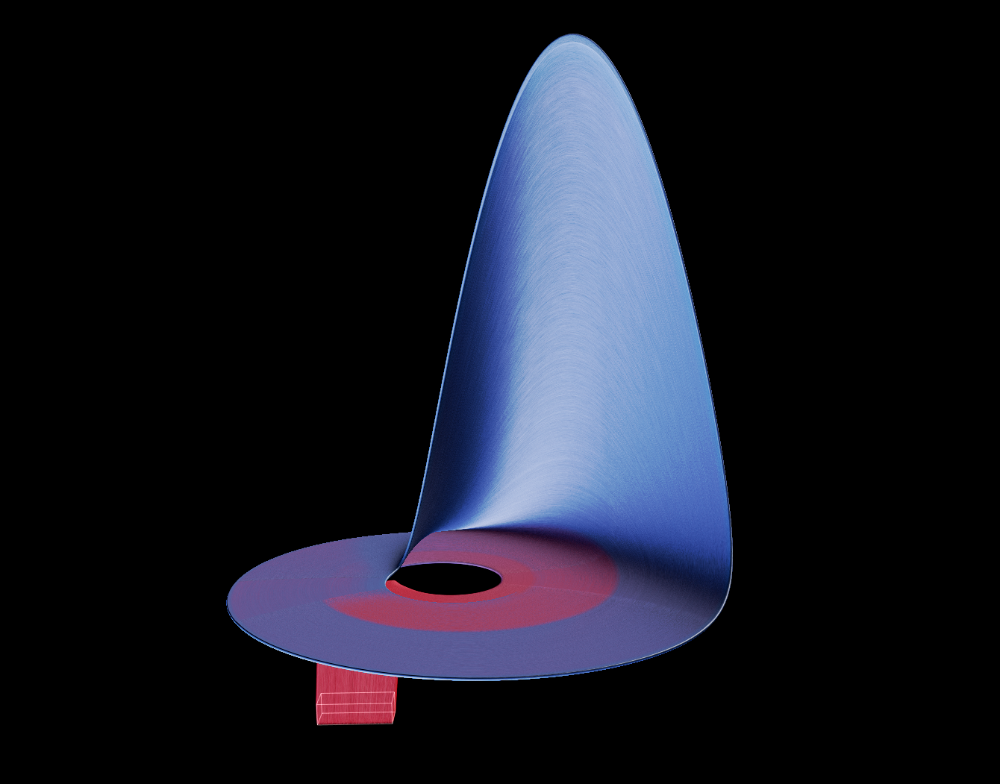</a><a href="https://portsmouth.github.io/fibre/?settings=eyJSIjp7InJheUJhdGNoIjoxMjgsIm1heFRpbWVTdGVwcyI6MjU2LCJtYXhJdGVyYXRpb25zIjoxMDAsImludGVncmF0aW9uVGltZSI6MjAsImludGVncmF0ZUZvcndhcmQiOnRydWUsImdyaWRTcGFjZSI6MC4wMiwidHViZVdpZHRoIjowLjAxNywidHViZVNwcmVhZCI6ZmFsc2UsInJlY29yZF9yZWFsdGltZSI6dHJ1ZSwieG1pbiI6LTMuMTc4MzY5MTE3MDA2OTM3LCJ4bWF4IjotMi42NDEwODY1Mjg5OTA5MzQsInltaW4iOi0zLjAzMjY1Mzg0MTEzNTczNiwieW1heCI6LTEuNjA3MTgxNDQ1MzYyOTM2Nywiem1pbiI6MTQuMDEwNTg5OTg0OTYwNjQsInptYXgiOjE2LjM3OTg3Nzk3MjA3MTc2OCwiY2xpcFRvQm91bmRzIjpmYWxzZSwic2hvd0JvdW5kcyI6dHJ1ZSwiZXhwb3N1cmUiOi0xLCJnYW1tYSI6MC45OTI0NjE3MDIwMDU2NTY1LCJjb250cmFzdCI6MSwic2F0dXJhdGlvbiI6MSwic3VidHJhY3RpdmVDb2xvciI6ZmFsc2UsImJnQ29sb3IiOlswLDAsMF0sImhhaXJTaGFkZXIiOmZhbHNlLCJzcGVjU2hpbmUiOjEwMCwic3BlY0NvbG9yIjpbMC4wMTk1MzI3NTA4ODA4ODExMzMsMC4wMTk1MzI3NTA4ODA4ODExMzMsMC4wMTk1MzI3NTA4ODA4ODExMzNdLCJsaWdodDFfY29sb3IiOlsxLDAuOSwwLjhdLCJsaWdodDJfY29sb3IiOlswLjgsMC45LDFdLCJsaWdodDFfZGlyIjpbMC41NzczNTAyNjkxODk2MjU4LDAuNTc3MzUwMjY5MTg5NjI1OCwwLjU3NzM1MDI2OTE4OTYyNThdLCJsaWdodDJfZGlyIjpbLTAuNTc3MzUwMjY5MTg5NjI1OCwtMC41NzczNTAyNjkxODk2MjU4LC0wLjU3NzM1MDI2OTE4OTYyNThdLCJkZXB0aFRlc3QiOnRydWUsImRhc2hfc3BhY2luZyI6MC41NDAzNDAyNTk5ODA4NTc0LCJkYXNoX3NwZWVkIjozMy4wODIwNTY3MzM1MjE4OSwiZGFzaF9zaXplIjowLjkxNTI3MDIzNjI5NDEwNTUsImRhc2hlcyI6ZmFsc2UsInN1YnRyYWN0aXZlX2NvbG9yIjpmYWxzZSwiaGFpclNoaW5lIjoxMCwiaGFpclNwZWNDb2xvciI6WzEsMSwxXX0sIkMiOnsicG9zIjpbLTEuMzcxNTE4NTgwNzk2NzAxOSwwLjcwOTg0MDMzODQ4NTk0OTksMjkuNjQyODQyMTUyNzIxMjg2XSwidGFyIjpbLTAuMDI2NjgzNzcyMTY2NDg5OTU1LDAuMjkyMjQ2NDczOTY4MDE1OCw5LjE0MjQzMTY4Nzk4NjQ1XSwibmVhciI6MC4wMzQ2NDEwMTYxNTEzNzc1NSwiZmFyIjozNDY0MS4wMTYxNTEzNzc1NDZ9LCJFIjp7ImNvZGUiOiJcbi8vLy8vLy8vLy8vLy8vLy8vLy8vLy8vLy8vLy8vLy8vLy8vLy8vLy8vLy9cbi8vIFJ1Y2tsaWRnZSBhdHRyYWN0b3Jcbi8vLy8vLy8vLy8vLy8vLy8vLy8vLy8vLy8vLy8vLy8vLy8vLy8vLy8vLy9cblxuY29uc3QgZmxvYXQga2FwcGEgPSBmbG9hdCgxLjg0KTtcbmNvbnN0IGZsb2F0IGFscGhhID0gZmxvYXQoNi43KTtcblxuI2RlZmluZSByZ2IgdmVjM1xuXG5jb25zdCB2ZWMzIGNvbExvID0gcmdiKDI1NCw0NSw3MykgLyAyNTUuMDtcbmNvbnN0IHZlYzMgY29sSGkgPSByZ2IoNSwxMzgsMjU1KSAvIDI1NS4wO1xuY29uc3QgZmxvYXQgbWFnU2NhbGUgPSBmbG9hdCg1KTtcblxuIHZlYzMgdmVsb2NpdHkodmVjMyBwLCBmbG9hdCB0KVxuIHtcbiAgICAgdmVjMyB2O1xuICAgICBmbG9hdCB4ID0gcC54O1xuICAgICBmbG9hdCB5ID0gcC55O1xuICAgICBmbG9hdCB6ID0gcC56O1xuICAgICB2LnggPSAta2FwcGEqeCArIGFscGhhKnkgLSB5Kno7XG4gICAgIHYueSA9IHg7XG4gICAgIHYueiA9IC16ICsgeSp5O1xuICAgICByZXR1cm4gdjtcbiB9ICAgIFxuIFxudmVjMyBjb2xvcih2ZWMzIHAsIGZsb2F0IHQpXG57XG4gICAgdmVjMyB2ID0gdmVsb2NpdHkocCwgdCk7XG4gIFx0ZmxvYXQgbWFnMiA9IHQvbWFnU2NhbGU7XG4gICAgZmxvYXQgbGVycCA9IG1hZzIvKDEuMCttYWcyKTtcbiAgICByZXR1cm4gKDEuMC1sZXJwKSpjb2xMbyArIGxlcnAqY29sSGk7XG59ICBcbiJ9fQ%3D%3D">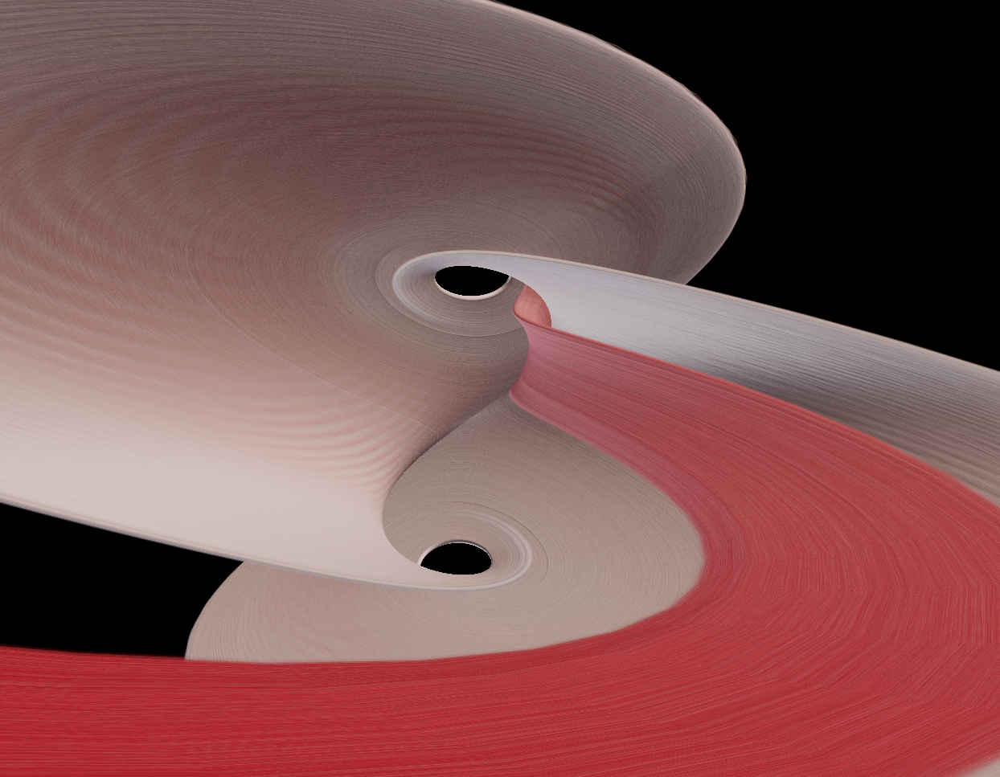</a><a href="https://portsmouth.github.io/fibre/?settings=eyJSIjp7InJheUJhdGNoIjoxMjgsIm1heFRpbWVTdGVwcyI6NDI4LCJtYXhJdGVyYXRpb25zIjoxMDAsImludGVncmF0aW9uVGltZSI6OCwiaW50ZWdyYXRlRm9yd2FyZCI6dHJ1ZSwiZ3JpZFNwYWNlIjowLjAwNSwidHViZVdpZHRoIjowLjAwNzA2NTMxMTA0NjAxMDY4NSwidHViZVNwcmVhZCI6ZmFsc2UsInJlY29yZF9yZWFsdGltZSI6dHJ1ZSwieG1pbiI6LTMuNzc5NTUwMTQ0MDI1NzgsInhtYXgiOi0wLjI1ODI1MDUwOTcyNjM5NDc0LCJ5bWluIjotMzYuMjA5NDY3NzYyMjY0NTcsInltYXgiOjQwLjgyNzYzMjExOTA0MjIyLCJ6bWluIjoxLjg5NzkzMzAxOTQwNzYzNjUsInptYXgiOjIuMTQ2MjkzNzExMDY5Mjk0LCJjbGlwVG9Cb3VuZHMiOmZhbHNlLCJzaG93Qm91bmRzIjp0cnVlLCJleHBvc3VyZSI6LTEsImdhbW1hIjowLjk5MjQ2MTcwMjAwNTY1NjUsImNvbnRyYXN0IjoxLCJzYXR1cmF0aW9uIjoxLjI3MDcyMjA0MDMyMzk3MDMsInN1YnRyYWN0aXZlQ29sb3IiOmZhbHNlLCJiZ0NvbG9yIjpbMCwwLDBdLCJoYWlyU2hhZGVyIjpmYWxzZSwic3BlY1NoaW5lIjozNS43NDAxMzQ0MTMyMzQ1Mywic3BlY0NvbG9yIjpbMC43NTQ5MDE5NjA3ODQzMTM3LDAuNzU0OTAxOTYwNzg0MzEzNywwLjc1NDkwMTk2MDc4NDMxMzddLCJsaWdodDFfY29sb3IiOlsxLDAuOSwwLjhdLCJsaWdodDJfY29sb3IiOlswLjgsMC45LDFdLCJsaWdodDFfZGlyIjpbMC41NzczNTAyNjkxODk2MjU4LDAuNTc3MzUwMjY5MTg5NjI1OCwwLjU3NzM1MDI2OTE4OTYyNThdLCJsaWdodDJfZGlyIjpbLTAuNTc3MzUwMjY5MTg5NjI1OCwtMC41NzczNTAyNjkxODk2MjU4LC0wLjU3NzM1MDI2OTE4OTYyNThdLCJkZXB0aFRlc3QiOnRydWUsImRhc2hfc3BhY2luZyI6MC41NDAzNDAyNTk5ODA4NTc0LCJkYXNoX3NwZWVkIjozMy4wODIwNTY3MzM1MjE4OSwiZGFzaF9zaXplIjowLCJkYXNoZXMiOmZhbHNlLCJzdWJ0cmFjdGl2ZV9jb2xvciI6ZmFsc2UsImhhaXJTaGluZSI6MTAsImhhaXJTcGVjQ29sb3IiOlsxLDEsMV19LCJDIjp7InBvcyI6WzU0LjI0NjU1NjMxMDUyMTY0LDIyLjE4ODMzNzYzNzM5NzQ5LC0xMjIuMTU0ODE0Njc0MjYyODJdLCJ0YXIiOlsyLjUzNTEwNzIxMjcyOTc4NSwxLjAwODc5NTA4NjM3NDA2MjcsMi4yNDU3MjQ1Mzg2MjI0NDA1XSwibmVhciI6MC4wMzQ2NDEwMTYxNTEzNzc1NSwiZmFyIjozNDY0MS4wMTYxNTEzNzc1NDZ9LCJFIjp7ImNvZGUiOiJcbi8vLy8vLy8vLy8vLy8vLy8vLy8vLy8vLy8vLy8vLy8vLy8vLy8vLy8vLy9cbi8vIFNha2FyeWEgYXR0cmFjdG9yXG4vLy8vLy8vLy8vLy8vLy8vLy8vLy8vLy8vLy8vLy8vLy8vLy8vLy8vLy8vXG5cbmNvbnN0IGZsb2F0IGEgPSBmbG9hdCgwLjQpO1xuY29uc3QgZmxvYXQgYiA9IGZsb2F0KDAuMyk7XG5cbiNkZWZpbmUgcmdiIHZlYzNcblxuY29uc3QgdmVjMyBjb2xMbyA9IHJnYigyNTQsNDUsNzMpIC8gMjU1LjA7XG5jb25zdCB2ZWMzIGNvbEhpID0gcmdiKDUsMTM4LDI1NSkgLyAyNTUuMDtcbmNvbnN0IGZsb2F0IG1hZ1NjYWxlID0gZmxvYXQoMS4wNCk7XG5cbiB2ZWMzIHZlbG9jaXR5KHZlYzMgcCwgZmxvYXQgdClcbiB7XG4gICAgIHZlYzMgdjtcbiAgICAgZmxvYXQgeCA9IHAueDtcbiAgICAgZmxvYXQgeSA9IHAueTtcbiAgICAgZmxvYXQgeiA9IHAuejtcbiAgICAgdi54ID0gLXggKyB5ICsgeSp6O1xuICAgICB2LnkgPSAteCAtIHkgKyBhKngqejtcbiAgICAgdi56ID0geiAtIGIqeCp5O1xuICAgICByZXR1cm4gdjtcbiB9ICAgIFxuIFxudmVjMyBjb2xvcih2ZWMzIHAsIGZsb2F0IHQpXG57XG4gICAgdmVjMyB2ID0gdmVsb2NpdHkocCwgdCk7XG4gIFx0ZmxvYXQgbWFnMiA9IHQvbWFnU2NhbGU7XG4gICAgZmxvYXQgbGVycCA9IG1hZzIvKDEuMCttYWcyKTtcbiAgICByZXR1cm4gKDEuMC1sZXJwKSpjb2xMbyArIGxlcnAqY29sSGk7XG59ICBcbiJ9fQ%3D%3D"></a>
<a href="https://portsmouth.github.io/fibre/?settings=eyJSIjp7InJheUJhdGNoIjoxMjgsIm1heFRpbWVTdGVwcyI6MjU2LCJtYXhJdGVyYXRpb25zIjoxMDAsImludGVncmF0aW9uVGltZSI6MjUsImludGVncmF0ZUZvcndhcmQiOnRydWUsImdyaWRTcGFjZSI6MC4wMiwidHViZVdpZHRoIjowLjAwNDg1OTU1NTQwMjM3ODA4LCJ0dWJlU3ByZWFkIjpmYWxzZSwicmVjb3JkX3JlYWx0aW1lIjp0cnVlLCJ4bWluIjotMC4zMzM1NzQzODY2MDUxNDIsInhtYXgiOjAuMTU5OTAxMzIxOTMyOTg1MTcsInltaW4iOjAuMDA2NzUyOTU0NTIxOTU2ODQ0LCJ5bWF4IjowLjAyNjMzMDM1ODI2MjgyODg2OCwiem1pbiI6MS4zODcxOTU2NDg0MDk2NTg4LCJ6bWF4IjozLjIzNzA0ODMxMDI1NzgxNDMsImNsaXBUb0JvdW5kcyI6ZmFsc2UsInNob3dCb3VuZHMiOnRydWUsImV4cG9zdXJlIjotMSwiZ2FtbWEiOjAuOTkyNDYxNzAyMDA1NjU2NSwiY29udHJhc3QiOjEsInNhdHVyYXRpb24iOjEsInN1YnRyYWN0aXZlQ29sb3IiOmZhbHNlLCJiZ0NvbG9yIjpbMCwwLDBdLCJoYWlyU2hhZGVyIjpmYWxzZSwic3BlY1NoaW5lIjoxMDAsInNwZWNDb2xvciI6WzAuMDE5NTMyNzUwODgwODgxMTMzLDAuMDE5NTMyNzUwODgwODgxMTMzLDAuMDE5NTMyNzUwODgwODgxMTMzXSwibGlnaHQxX2NvbG9yIjpbMSwwLjksMC44XSwibGlnaHQyX2NvbG9yIjpbMC44LDAuOSwxXSwibGlnaHQxX2RpciI6WzAuNTc3MzUwMjY5MTg5NjI1OCwwLjU3NzM1MDI2OTE4OTYyNTgsMC41NzczNTAyNjkxODk2MjU4XSwibGlnaHQyX2RpciI6Wy0wLjU3NzM1MDI2OTE4OTYyNTgsLTAuNTc3MzUwMjY5MTg5NjI1OCwtMC41NzczNTAyNjkxODk2MjU4XSwiZGVwdGhUZXN0Ijp0cnVlLCJkYXNoX3NwYWNpbmciOjAuNTQwMzQwMjU5OTgwODU3NCwiZGFzaF9zcGVlZCI6MzMuMDgyMDU2NzMzNTIxODksImRhc2hfc2l6ZSI6MC45MTUyNzAyMzYyOTQxMDU1LCJkYXNoZXMiOmZhbHNlLCJzdWJ0cmFjdGl2ZV9jb2xvciI6ZmFsc2UsImhhaXJTaGluZSI6MTAsImhhaXJTcGVjQ29sb3IiOlsxLDEsMV19LCJDIjp7InBvcyI6Wy0wLjIxMjQ4NjgzMzQ3NTQ1NTU1LC0wLjk5NzQ4MjY3MDQxMDA1NSw1LjY2MzAxODAwMzg4MjY3Ml0sInRhciI6Wy0wLjE4MDk3MjIxNDA5MzMyOTEsMC4yMTQ0NDkxMzAwNzk4MjM3MiwxLjMzMzI4MDMwNDE5MjA3MV0sIm5lYXIiOjAuMDM0NjQxMDE2MTUxMzc3NTUsImZhciI6MzQ2NDEuMDE2MTUxMzc3NTQ2fSwiRSI6eyJjb2RlIjoiXG4vLy8vLy8vLy8vLy8vLy8vLy8vLy8vLy8vLy8vLy8vLy8vLy8vLy8vLy8vXG4vLyBTaGltaXp1LU1vcmlva2EgYXR0cmFjdG9yXG4vLy8vLy8vLy8vLy8vLy8vLy8vLy8vLy8vLy8vLy8vLy8vLy8vLy8vLy8vXG5cbmNvbnN0IGZsb2F0IGEgPSBmbG9hdCgwLjc1KTtcbmNvbnN0IGZsb2F0IGIgPSBmbG9hdCgwLjQ1KTtcblxuI2RlZmluZSByZ2IgdmVjM1xuXG5jb25zdCB2ZWMzIGNvbExvID0gcmdiKDI1NCw0NSw3MykgLyAyNTUuMDtcbmNvbnN0IHZlYzMgY29sSGkgPSByZ2IoNSwxMzgsMjU1KSAvIDI1NS4wO1xuY29uc3QgZmxvYXQgbWFnU2NhbGUgPSBmbG9hdCg1KTtcblxuIHZlYzMgdmVsb2NpdHkodmVjMyBwLCBmbG9hdCB0KVxuIHtcbiAgICAgdmVjMyB2O1xuICAgICBmbG9hdCB4ID0gcC54O1xuICAgICBmbG9hdCB5ID0gcC55O1xuICAgICBmbG9hdCB6ID0gcC56O1xuICAgICB2LnggPSB5O1xuICAgICB2LnkgPSAoMS4wLXopKnggLSBhKnk7XG4gICAgIHYueiA9IHgqeCAtIGIqejtcbiAgICAgcmV0dXJuIHY7XG4gfSAgICBcbiBcbnZlYzMgY29sb3IodmVjMyBwLCBmbG9hdCB0KVxue1xuICAgIHZlYzMgdiA9IHZlbG9jaXR5KHAsIHQpO1xuICBcdGZsb2F0IG1hZzIgPSB0L21hZ1NjYWxlO1xuICAgIGZsb2F0IGxlcnAgPSBtYWcyLygxLjArbWFnMik7XG4gICAgcmV0dXJuICgxLjAtbGVycCkqY29sTG8gKyBsZXJwKmNvbEhpO1xufSAgXG4ifX0%3D">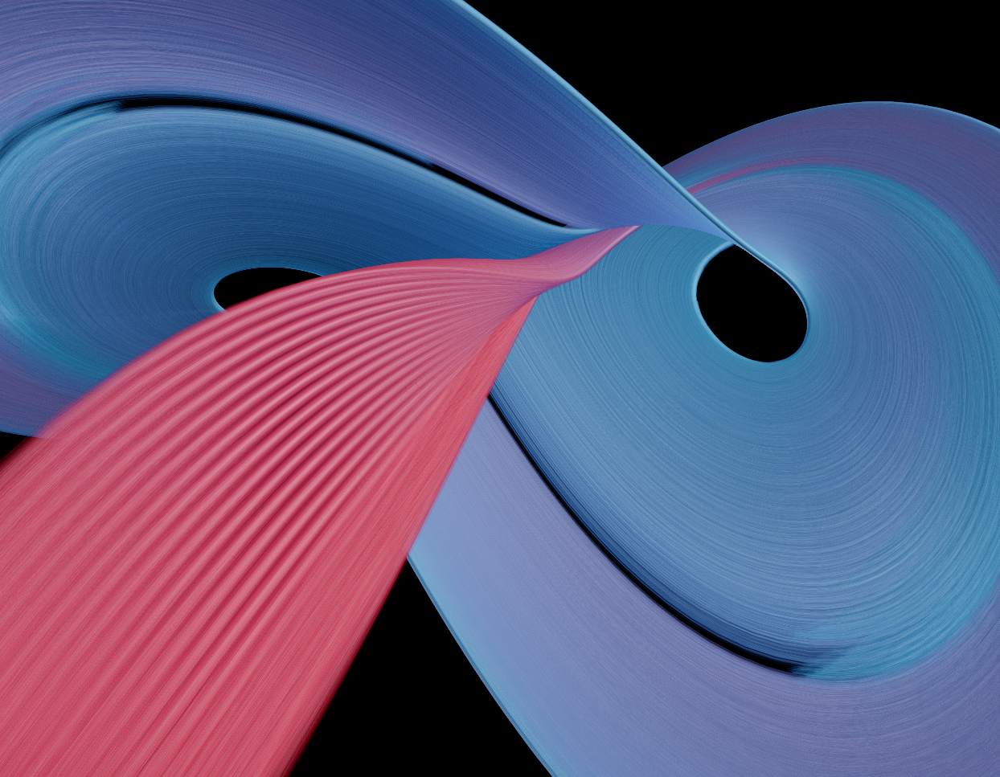</a><a href="https://portsmouth.github.io/fibre/?settings=eyJSIjp7InJheUJhdGNoIjoxMjgsIm1heFRpbWVTdGVwcyI6MjU2LCJtYXhJdGVyYXRpb25zIjoxMDAsImludGVncmF0aW9uVGltZSI6MjAsImludGVncmF0ZUZvcndhcmQiOnRydWUsImdyaWRTcGFjZSI6MC4wMzc1NjY3NzU4MDU2MTc3ODQsInR1YmVXaWR0aCI6MC4wMTAzNzM5NDQ1MTE0NTk1OTEsInR1YmVTcHJlYWQiOmZhbHNlLCJyZWNvcmRfcmVhbHRpbWUiOnRydWUsInhtaW4iOi0xLjI4MTQyNTMzNDA1NzM0NjcsInhtYXgiOjIuMDk1MjkxNDAxNTQxMzQ3MywieW1pbiI6LTEuMzQ5NTI1NDUxNjYzMTYzNiwieW1heCI6MC4wNDQ2NDMxMTA1NjcxNTg2OTUsInptaW4iOi0xMC45ODAzODYwOTE4OTQyOCwiem1heCI6LTEwLjgyNTU0MDc4ODM0MTc4NSwiY2xpcFRvQm91bmRzIjpmYWxzZSwic2hvd0JvdW5kcyI6dHJ1ZSwiZXhwb3N1cmUiOi0xLCJnYW1tYSI6MC45OTI0NjE3MDIwMDU2NTY1LCJjb250cmFzdCI6MS4wNzIyMDQwMzIzOTcwMzU5LCJzYXR1cmF0aW9uIjoxLjEwNTI5MDM2NzA1MTUyNSwic3VidHJhY3RpdmVDb2xvciI6ZmFsc2UsImJnQ29sb3IiOlswLDAsMF0sImhhaXJTaGFkZXIiOmZhbHNlLCJzcGVjU2hpbmUiOjQ1LjY2NjAzNDgwOTU4MTI1NSwic3BlY0NvbG9yIjpbMSwxLDFdLCJsaWdodDFfY29sb3IiOlsxLDAuOSwwLjhdLCJsaWdodDJfY29sb3IiOlswLjgsMC45LDFdLCJsaWdodDFfZGlyIjpbMC41NzczNTAyNjkxODk2MjU4LDAuNTc3MzUwMjY5MTg5NjI1OCwwLjU3NzM1MDI2OTE4OTYyNThdLCJsaWdodDJfZGlyIjpbLTAuNTc3MzUwMjY5MTg5NjI1OCwtMC41NzczNTAyNjkxODk2MjU4LC0wLjU3NzM1MDI2OTE4OTYyNThdLCJkZXB0aFRlc3QiOnRydWUsImRhc2hfc3BhY2luZyI6MC41NDAzNDAyNTk5ODA4NTc0LCJkYXNoX3NwZWVkIjozMy4wODIwNTY3MzM1MjE4OSwiZGFzaF9zaXplIjowLjkxNTI3MDIzNjI5NDEwNTUsImRhc2hlcyI6ZmFsc2UsInN1YnRyYWN0aXZlX2NvbG9yIjpmYWxzZSwiaGFpclNoaW5lIjoxMCwiaGFpclNwZWNDb2xvciI6WzEsMSwxXX0sIkMiOnsicG9zIjpbMTMuMjQyOTM0MzEyNzQwNiwtMC4zNDU2MTg0MDg3Mzg2MzU2LC0xNy4xNTMwODYwNzkxMjUzMTZdLCJ0YXIiOlstMC43OTczMzg3ODk5NTgyODE4LDAuMDQ0Mjg5NTQ5OTc2ODk2MDIsLTIuOTc2NTY0NjAwNjg1OTQ4N10sIm5lYXIiOjAuMDM0NjQxMDE2MTUxMzc3NTUsImZhciI6MzQ2NDEuMDE2MTUxMzc3NTQ2fSwiRSI6eyJjb2RlIjoiXG4vLy8vLy8vLy8vLy8vLy8vLy8vLy8vLy8vLy8vLy8vLy8vLy8vLy8vLy8vXG4vLyBTcHJvdHQtTGlueiBhdHRyYWN0b3Jcbi8vLy8vLy8vLy8vLy8vLy8vLy8vLy8vLy8vLy8vLy8vLy8vLy8vLy8vLy9cblxuY29uc3QgZmxvYXQgYSA9IGZsb2F0KDAuNDgpO1xuY29uc3QgZmxvYXQgYiA9IGZsb2F0KDEuNDgpO1xuY29uc3QgZmxvYXQgYyA9IGZsb2F0KDAuMTYpO1xuY29uc3QgZmxvYXQgZCA9IGZsb2F0KDEuMCk7XG5jb25zdCBmbG9hdCBlID0gZmxvYXQoMS4wKTtcblxuI2RlZmluZSByZ2IgdmVjM1xuXG5jb25zdCB2ZWMzIGNvbExvID0gcmdiKDI1NCw0NSw3MykgLyAyNTUuMDtcbmNvbnN0IHZlYzMgY29sSGkgPSByZ2IoNSwxMzgsMjU1KSAvIDI1NS4wO1xuY29uc3QgZmxvYXQgbWFnU2NhbGUgPSBmbG9hdCgzKTtcblxuIHZlYzMgdmVsb2NpdHkodmVjMyBwLCBmbG9hdCB0KVxuIHtcbiAgICAgdmVjMyB2O1xuICAgICBmbG9hdCB4ID0gcC54O1xuICAgICBmbG9hdCB5ID0gcC55O1xuICAgICBmbG9hdCB6ID0gcC56O1xuICAgICB2LnggPSBhKnkqejtcbiAgICAgdi55ID0gYip4IC0gYyp5O1xuICAgICB2LnogPSBkIC0gZSp4Knk7XG4gICAgIHJldHVybiB2O1xuIH0gICAgXG4gXG52ZWMzIGNvbG9yKHZlYzMgcCwgZmxvYXQgdClcbntcbiAgICB2ZWMzIHYgPSB2ZWxvY2l0eShwLCB0KTtcbiAgXHRmbG9hdCBtYWcyID0gYWJzKHQpL21hZ1NjYWxlO1xuICAgIGZsb2F0IGxlcnAgPSBtYWcyLygxLjArbWFnMik7XG4gICAgcmV0dXJuICgxLjAtbGVycCkqY29sTG8gKyBsZXJwKmNvbEhpO1xufSAgXG4ifX0%3D">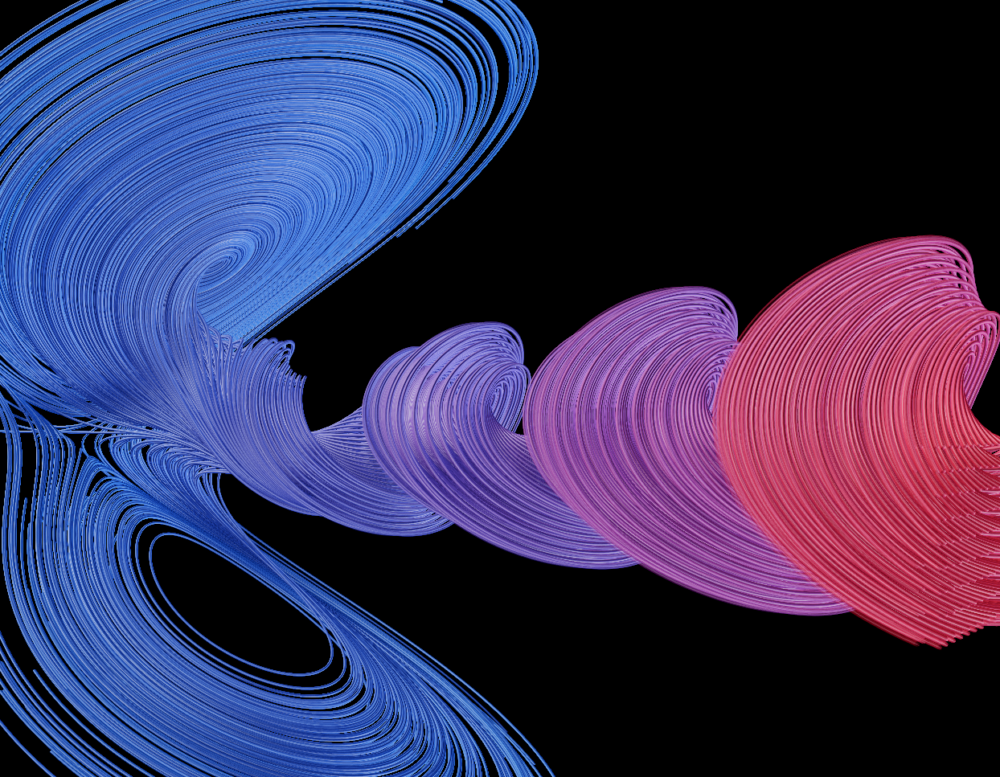</a><a href="https://portsmouth.github.io/fibre/?settings=eyJSIjp7InJheUJhdGNoIjoxMjgsIm1heFRpbWVTdGVwcyI6MTI4LCJtYXhJdGVyYXRpb25zIjoxMDAsImludGVncmF0aW9uVGltZSI6MjAsImludGVncmF0ZUZvcndhcmQiOnRydWUsImdyaWRTcGFjZSI6MC4wMSwidHViZVdpZHRoIjowLjAwMSwidHViZVNwcmVhZCI6ZmFsc2UsInJlY29yZF9yZWFsdGltZSI6dHJ1ZSwieG1pbiI6Ny40MzA0MzA0NTM1OTM5NDg1LCJ4bWF4Ijo3LjQzMDQzMDQ1MzU5Mzk0ODUsInltaW4iOi0xNS40NzkyODQ0NDg1MDY2NSwieW1heCI6MTUuNTMyODQ3MDgyMDYwNTQ1LCJ6bWluIjotMTQuMDIyNzUwNzQ4NzM5NTE1LCJ6bWF4IjoxNy40MzAwNzQ2Mjg1OTUxNjUsImNsaXBUb0JvdW5kcyI6ZmFsc2UsInNob3dCb3VuZHMiOnRydWUsImV4cG9zdXJlIjotMS4wODczNjg2MDI0NDcwMDkzLCJnYW1tYSI6MC45OTI0NjE3MDIwMDU2NTY1LCJjb250cmFzdCI6MS4yMzc2MzU3MDU2Njk0ODEzLCJzYXR1cmF0aW9uIjoxLjMwMzgwODM3NDk3ODQ1OTUsInN1YnRyYWN0aXZlQ29sb3IiOmZhbHNlLCJiZ0NvbG9yIjpbMCwwLDBdLCJoYWlyU2hhZGVyIjp0cnVlLCJzcGVjU2hpbmUiOjYxLjEwNjMyNDMxNTAwOTQ3LCJzcGVjQ29sb3IiOlswLjA3ODQzMTM3MjU0OTAxOTY2LDAuMDc4NDMxMzcyNTQ5MDE5NjYsMC4wNzg0MzEzNzI1NDkwMTk2Nl0sImxpZ2h0MV9jb2xvciI6WzEsMC45LDAuOF0sImxpZ2h0Ml9jb2xvciI6WzAuOCwwLjksMV0sImxpZ2h0MV9kaXIiOlswLjU3NzM1MDI2OTE4OTYyNTgsMC41NzczNTAyNjkxODk2MjU4LDAuNTc3MzUwMjY5MTg5NjI1OF0sImxpZ2h0Ml9kaXIiOlstMC41NzczNTAyNjkxODk2MjU4LC0wLjU3NzM1MDI2OTE4OTYyNTgsLTAuNTc3MzUwMjY5MTg5NjI1OF0sImRlcHRoVGVzdCI6dHJ1ZSwiZGFzaF9zcGFjaW5nIjowLjAwNCwiZGFzaF9zcGVlZCI6OCwiZGFzaF9zaXplIjowLjQxMjU0NTIzNTIyMzE2MDQ0LCJkYXNoZXMiOmZhbHNlLCJzdWJ0cmFjdGl2ZV9jb2xvciI6ZmFsc2UsImhhaXJTaGluZSI6MTAsImhhaXJTcGVjQ29sb3IiOlsxLDEsMV19LCJDIjp7InBvcyI6Wy0yOS42NDE0ODA2MjU4MTYwMjMsMi40NDY2MTAzOTI5NTkwNzEyLC0zOS4yMTQxNjg0OTMzOTUwMzZdLCJ0YXIiOls4LjQ2ODcyMzM4NTU5MTYwNCwtMC45NzM1NjExMjU0Nzg3OTgzLDEuNTQ4NjQyMTM4OTQ0NjU0NV0sIm5lYXIiOjAuMDM0NjQxMDE2MTUxMzc3NTUsImZhciI6MzQ2NDEuMDE2MTUxMzc3NTQ2fSwiRSI6eyJjb2RlIjoiXG4vLy8vLy8vLy8vLy8vLy8vLy8vLy8vLy8vLy8vLy8vLy8vLy8vLy8vLy8vXG4vLyBUaG9tYXMgYXR0cmFjdG9yXG4vLy8vLy8vLy8vLy8vLy8vLy8vLy8vLy8vLy8vLy8vLy8vLy8vLy8vLy8vXG5cbmNvbnN0IGZsb2F0IGIgPSBmbG9hdCgwLjE1NDgzMTYwNzU2MjI0KTtcblxuI2RlZmluZSByZ2IgdmVjM1xuXG5jb25zdCB2ZWMzIGNvbExvID0gcmdiKDI1NCw0NSw3MykgLyAyNTUuMDtcbmNvbnN0IHZlYzMgY29sSGkgPSByZ2IoNSwxMzgsMjU1KSAvIDI1NS4wO1xuY29uc3QgZmxvYXQgbWFnU2NhbGUgPSBmbG9hdCgxLjM0MTg0OTYpO1xuXG4gdmVjMyB2ZWxvY2l0eSh2ZWMzIHAsIGZsb2F0IHQpXG4ge1xuICAgICB2ZWMzIHY7XG4gICAgIGZsb2F0IHggPSBwLng7XG4gICAgIGZsb2F0IHkgPSBwLnk7XG4gICAgIGZsb2F0IHogPSBwLno7XG4gICAgIHYueCA9IC1iKnggKyBzaW4oeSk7XG4gICAgIHYueSA9IC1iKnkgKyBzaW4oeik7XG4gICAgIHYueiA9IC1iKnogKyBzaW4oeCk7XG4gICAgIHJldHVybiB2O1xuIH0gICAgXG4gXG52ZWMzIGNvbG9yKHZlYzMgcCwgZmxvYXQgdClcbntcbiAgICB2ZWMzIHYgPSB2ZWxvY2l0eShwLCB0KTtcbiAgXHRmbG9hdCBtYWcyID0gbGVuZ3RoKHYpL21hZ1NjYWxlO1xuICAgIGZsb2F0IGxlcnAgPSBtYWcyLygxLjArbWFnMik7XG4gICAgcmV0dXJuICgxLjAtbGVycCkqY29sTG8gKyBsZXJwKmNvbEhpO1xufSAgXG4ifX0%3D"></a>
<a href="https://portsmouth.github.io/fibre/?settings=eyJSIjp7InJheUJhdGNoIjoxMjgsIm1heFRpbWVTdGVwcyI6MjU2LCJtYXhJdGVyYXRpb25zIjoxMDAsImludGVncmF0aW9uVGltZSI6MywiaW50ZWdyYXRlRm9yd2FyZCI6dHJ1ZSwiZ3JpZFNwYWNlIjowLjAwNSwidHViZVdpZHRoIjowLjAxNywidHViZVNwcmVhZCI6ZmFsc2UsInJlY29yZF9yZWFsdGltZSI6dHJ1ZSwieG1pbiI6LTQuOTkyNTQwOTI2MzA0NDIyLCJ4bWF4IjoyNy41NjEwMzQxMDAwNzYxMDcsInltaW4iOjAuMjUyMDU4Mzg4ODQ0OTY1LCJ5bWF4IjoyLjQ2MjExNTQ1MjU1NjE2Miwiem1pbiI6LTkuNzMxMTU2MTM3ODE1NTgyLCJ6bWF4IjotMy4yNDczNTg3MDMxMjE3NDQsImNsaXBUb0JvdW5kcyI6ZmFsc2UsInNob3dCb3VuZHMiOnRydWUsImV4cG9zdXJlIjotMSwiZ2FtbWEiOjAuOTkyNDYxNzAyMDA1NjU2NSwiY29udHJhc3QiOjEsInNhdHVyYXRpb24iOjEuNDM2MTUzNzEzNTk2NDE1NSwic3VidHJhY3RpdmVDb2xvciI6ZmFsc2UsImJnQ29sb3IiOlswLDAsMF0sImhhaXJTaGFkZXIiOmZhbHNlLCJzcGVjU2hpbmUiOjQ4Ljk3NDY2ODI3NTAzMDE2LCJzcGVjQ29sb3IiOlswLjg3MjU0OTAxOTYwNzg0MzEsMC44NzI1NDkwMTk2MDc4NDMxLDAuODcyNTQ5MDE5NjA3ODQzMV0sImxpZ2h0MV9jb2xvciI6WzEsMC45LDAuOF0sImxpZ2h0Ml9jb2xvciI6WzAuOCwwLjksMV0sImxpZ2h0MV9kaXIiOlswLjU3NzM1MDI2OTE4OTYyNTgsMC41NzczNTAyNjkxODk2MjU4LDAuNTc3MzUwMjY5MTg5NjI1OF0sImxpZ2h0Ml9kaXIiOlstMC41NzczNTAyNjkxODk2MjU4LC0wLjU3NzM1MDI2OTE4OTYyNTgsLTAuNTc3MzUwMjY5MTg5NjI1OF0sImRlcHRoVGVzdCI6dHJ1ZSwiZGFzaF9zcGFjaW5nIjowLjU0MDM0MDI1OTk4MDg1NzQsImRhc2hfc3BlZWQiOjMzLjA4MjA1NjczMzUyMTg5LCJkYXNoX3NpemUiOjAuOTE1MjcwMjM2Mjk0MTA1NSwiZGFzaGVzIjpmYWxzZSwic3VidHJhY3RpdmVfY29sb3IiOmZhbHNlLCJoYWlyU2hpbmUiOjEwLCJoYWlyU3BlY0NvbG9yIjpbMSwxLDFdfSwiQyI6eyJwb3MiOlstMTc5Ljg0MDQ0ODI0NjE1NzQ1LDM1LjQxMjg5MTM0MTY0ODE4LC00MC41MzY5MzE0NjEwOTc3MV0sInRhciI6WzIxLjEwMDE1MTk2NzQwNDY0MiwtOS40OTAyNDIzNzMyNjE2Myw0MS42NzgwNDUyNjc5NzM4NF0sIm5lYXIiOjAuMDM0NjQxMDE2MTUxMzc3NTUsImZhciI6MzQ2NDEuMDE2MTUxMzc3NTQ2fSwiRSI6eyJjb2RlIjoiXG4vLy8vLy8vLy8vLy8vLy8vLy8vLy8vLy8vLy8vLy8vLy8vLy8vLy8vLy8vXG4vLyBUU1VDUzEgYXR0cmFjdG9yXG4vLy8vLy8vLy8vLy8vLy8vLy8vLy8vLy8vLy8vLy8vLy8vLy8vLy8vLy8vXG5cbmNvbnN0IGZsb2F0IGEgPSBmbG9hdCg0MCk7XG5jb25zdCBmbG9hdCBjID0gZmxvYXQoMC41OTk3Nik7XG5jb25zdCBmbG9hdCBkID0gZmxvYXQoMC41KTtcbmNvbnN0IGZsb2F0IGUgPSBmbG9hdCgwLjY1KTtcbmNvbnN0IGZsb2F0IGYgPSBmbG9hdCgyMCk7XG5cbiNkZWZpbmUgcmdiIHZlYzNcblxuY29uc3QgdmVjMyBjb2xMbyA9IHJnYigyNTQsNDUsNzMpIC8gMjU1LjA7XG5jb25zdCB2ZWMzIGNvbEhpID0gcmdiKDUsMTM4LDI1NSkgLyAyNTUuMDtcbmNvbnN0IGZsb2F0IG1hZ1NjYWxlID0gZmxvYXQoMC45NTU2Mzc3Nik7XG5cbiB2ZWMzIHZlbG9jaXR5KHZlYzMgcCwgZmxvYXQgdClcbiB7XG4gICAgIHZlYzMgdjtcbiAgICAgZmxvYXQgeCA9IHAueDtcbiAgICAgZmxvYXQgeSA9IHAueTtcbiAgICAgZmxvYXQgeiA9IHAuejtcbiAgICAgdi54ID0gYSooeSAtIHgpICsgZCp4Kno7XG4gICAgIHYueSA9IGYqeSAtIHgqejtcbiAgICAgdi56ID0gYyp6ICsgeCp5IC0gZSp4Kng7XG4gICAgIHJldHVybiB2O1xuIH0gICAgXG4gXG52ZWMzIGNvbG9yKHZlYzMgcCwgZmxvYXQgdClcbntcbiAgICB2ZWMzIHYgPSB2ZWxvY2l0eShwLCB0KTtcbiAgXHRmbG9hdCBtYWcyID0gdC9tYWdTY2FsZTtcbiAgICBmbG9hdCBsZXJwID0gbWFnMi8oMS4wK21hZzIpO1xuICAgIHJldHVybiAoMS4wLWxlcnApKmNvbExvICsgbGVycCpjb2xIaTtcbn0gIFxuIn19">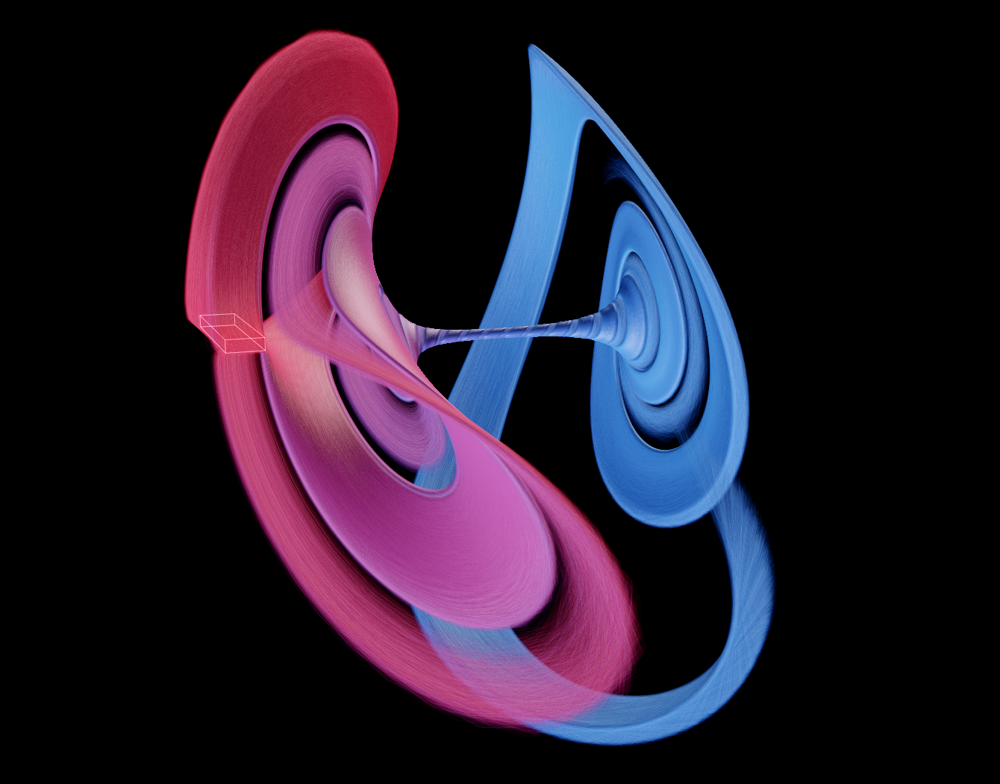</a>

In three (or more) dimensions, a non-linear [dynamical system](https://en.wikipedia.org/wiki/Dynamical_system) may exhibit [chaos](https://en.wikipedia.org/wiki/Chaos_theory), which is characterised by sensitive dependence of the solution trajectories to the initial conditions, and evolution governed by a so-called ["strange attractor"](https://en.wikipedia.org/wiki/Attractor#Strange_attractor). Probably the most famous example is the [Lorenz system](https://en.wikipedia.org/wiki/Lorenz_system), initially discovered as a simplified model of atmospheric convection:

whose solutions (x(t), y(t), z(t)) tend to the [Lorenz strange attractor](https://portsmouth.github.io/fibre/?settings=eyJSIjp7InJheUJhdGNoIjoxMjgsIm1heFRpbWVTdGVwcyI6MjI5LCJtYXhJdGVyYXRpb25zIjoxMDAsImludGVncmF0aW9uVGltZSI6MiwiaW50ZWdyYXRlRm9yd2FyZCI6dHJ1ZSwiZ3JpZFNwYWNlIjowLjAzMzA4MjA1NjczMzUyMTgwNCwidHViZVdpZHRoIjowLjAxMzIzMjgyMjY5MzQwODcyMywidHViZVNwcmVhZCI6ZmFsc2UsInJlY29yZF9yZWFsdGltZSI6dHJ1ZSwieG1pbiI6MTguMTI3NTIxNDk3MTg5NjI2LCJ4bWF4IjoyNi43NDEyMjM2ODMyMjY3NzgsInltaW4iOi0xNS4xMDMyMzE2NzQyNjQ5NDUsInltYXgiOi04LjczODI1MzU0Njc5NDE0Mywiem1pbiI6MTkuMjU3MzA2NjExNDgwNjYsInptYXgiOjIxLjU4ODgyMDMyODM4NTQ2MywiY2xpcFRvQm91bmRzIjpmYWxzZSwic2hvd0JvdW5kcyI6dHJ1ZSwiZXhwb3N1cmUiOi0wLjc1MzM5MjIwMzMxNjgyMSwiZ2FtbWEiOjAuOTkyNDYxNzAyMDA1NjU2NSwiY29udHJhc3QiOjEuMTIyMzM0Njk3MzkzOTI2Mywic2F0dXJhdGlvbiI6MS4zODY5OTExNjk1MDI0NzcsInN1YnRyYWN0aXZlQ29sb3IiOmZhbHNlLCJiZ0NvbG9yIjpbMCwwLDBdLCJoYWlyU2hhZGVyIjpmYWxzZSwic3BlY1NoaW5lIjoyMS45NzI4NjIzNzM0NjU0MzIsInNwZWNDb2xvciI6WzAuOTAxOTUzMjc1MDg4MDg4MSwwLjg5MzEwOTkxODYyMzQ5MjEsMC44OTMxMDk5MTg2MjM0OTIxXSwibGlnaHQxX2NvbG9yIjpbMSwwLjksMC44XSwibGlnaHQyX2NvbG9yIjpbMC44LDAuOSwxXSwibGlnaHQxX2RpciI6WzAuNTc3MzUwMjY5MTg5NjI1OCwwLjU3NzM1MDI2OTE4OTYyNTgsMC41NzczNTAyNjkxODk2MjU4XSwibGlnaHQyX2RpciI6Wy0wLjU3NzM1MDI2OTE4OTYyNTgsLTAuNTc3MzUwMjY5MTg5NjI1OCwtMC41NzczNTAyNjkxODk2MjU4XSwiZGVwdGhUZXN0Ijp0cnVlLCJkYXNoX3NwYWNpbmciOjAuNTQwMzQwMjU5OTgwODU3NCwiZGFzaF9zcGVlZCI6MzMuMDgyMDU2NzMzNTIxODksImRhc2hfc2l6ZSI6MC45MTUyNzAyMzYyOTQxMDU1LCJkYXNoZXMiOmZhbHNlLCJzdWJ0cmFjdGl2ZV9jb2xvciI6ZmFsc2UsImhhaXJTaGluZSI6MTAsImhhaXJTcGVjQ29sb3IiOlsxLDEsMV19LCJDIjp7InBvcyI6Wy03LjQyNjkzNjMzNzgzOTcxLC02Ljk5ODI1Mjk3MjIzMzY1OSwxMTcuMTMyNDU3OTg4NDA0MDddLCJ0YXIiOlsxLjE4NTQzMDE1NTUyNDU3NCwtMS4zMzUzOTk3MDQyNDcyNDA1LDI3Ljk0Nzk3NzA0NDE1MDk1N10sIm5lYXIiOjAuMDM0NjQxMDE2MTUxMzc3NTUsImZhciI6MzQ2NDEuMDE2MTUxMzc3NTQ2fSwiRSI6eyJjb2RlIjoiXG4vLy8vLy8vLy8vLy8vLy8vLy8vLy8vLy8vLy8vLy8vLy8vLy8vLy8vLy8vXG4vLyBMb3JlbnogYXR0cmFjdG9yXG4vLy8vLy8vLy8vLy8vLy8vLy8vLy8vLy8vLy8vLy8vLy8vLy8vLy8vLy8vXG5cbmNvbnN0IGZsb2F0IGthcHBhID0gZmxvYXQoMS44NCk7XG5jb25zdCBmbG9hdCBhbHBoYSA9IGZsb2F0KDYuNyk7XG5cbiNkZWZpbmUgcmdiIHZlYzNcblxuY29uc3QgdmVjMyBjb2xMbyA9IHJnYigyNTQsNDUsNzMpIC8gMjU1LjA7XG5jb25zdCB2ZWMzIGNvbEhpID0gcmdiKDUsMTM4LDI1NSkgLyAyNTUuMDtcbmNvbnN0IGZsb2F0IG1hZ1NjYWxlID0gZmxvYXQoMC42KTtcblxuY29uc3QgZmxvYXQgcmhvICAgPSBmbG9hdCgyOC4wKTsgICAgIFxuY29uc3QgZmxvYXQgc2lnbWEgPSBmbG9hdCgxMC4wKTtcbmNvbnN0IGZsb2F0IGJldGEgID0gZmxvYXQoOC4wKS9mbG9hdCgzLjApO1xuXG5cbiB2ZWMzIHZlbG9jaXR5KHZlYzMgcCwgZmxvYXQgdClcbiB7XG4gICAgIHZlYzMgdjtcbiAgICAgZmxvYXQgeCA9IHAueDtcbiAgICAgZmxvYXQgeSA9IHAueTtcbiAgICAgZmxvYXQgeiA9IHAuejtcbiAgICAgdi54ID0gc2lnbWEqKHkgLSB4KTtcbiAgICAgdi55ID0geCoocmhvIC0geik7XG4gICAgIHYueiA9IHgqeSAtIGJldGEqejtcbiAgICAgcmV0dXJuIHY7XG4gfSAgICBcbiBcbiBcbnZlYzMgY29sb3IodmVjMyBwLCBmbG9hdCB0KVxue1xuICAgIHZlYzMgdiA9IHZlbG9jaXR5KHAsIHQpO1xuICBcdGZsb2F0IG1hZzIgPSB0L21hZ1NjYWxlO1xuICAgIGZsb2F0IGxlcnAgPSBtYWcyLygxLjArbWFnMik7XG4gICAgcmV0dXJuICgxLjAtbGVycCkqY29sTG8gKyBsZXJwKmNvbEhpO1xufSAgXG4ifX0%3D).

In general, a three-dimensional dynamical system is an [ordinary differential equation](https://en.wikipedia.org/wiki/Ordinary_differential_equation) (ODE) of the form below, where the functions on the right hand side define a [*vector field*](https://en.wikipedia.org/wiki/Vector_field) giving the velocity vector of the dynamical system at each point in space (and, optionally, time):

In Fibre, the code editor on the left specifies this velocity vector field
via the GLSL function `vec3 velocity(vec3 p, float t)` . Additionally, a color at each point in space must be specified via `vec3 color(vec3 p, float t)`. The system then traces the solution curves of the ODE (using the [Runge-Kutta](https://en.wikipedia.org/wiki/Runge%E2%80%93Kutta_methods) method), starting from a grid of points covering the "initial conditions box" positioned in the viewport. These curves are rendered as colored tubes. (Note, the tubes are not rendered as geometry, they consist of many individual line segments, which are progressively rendered and blended over a number of iterations in order to converge to the final image).

## UI controls:
 - left-click mouse to rotate, right-click mouse to pan camera
 - hover over the initial conditions box and left-click to drag it around, or hover over the box corners and left-click to resize the box dimensions. The box extents can also be edited directly in the `Integrator` rollout of the UI.
 - editing the GLSL code immediately updates the shader -- if there is an error, this will be copied to the viewport, and rendering terminated
 - click on values in the code editor to pop up a slider which scrubs the value 
 - click on colors (e.g. `rgb(255, 0, 0)`) in the code editor to pop up a color wheel
 - AWSD keys to fly
 - C key to frame camera on the initial conditions box
 - P key to capture a screenshot of the current render in a new browser window
 - H key to hide/show the sidebar UI
 - F11 key to enter/exit fullscreen mode
 - The `@` button generates a data URL which can be used to save and share the current vector field

## Integration parameters

- *gridSpace*: the spacing between start points within the initial conditions box, relative to the box maximum extents
- *tubeWidth*: the radius of the rendered solution tubes, relative to the box maximum extents
- *integrationTime*: the total time to integrate over
- *maxTimeSteps*: the number of timesteps into which the `integrationTime` is broken into
- *xmin*: (etc.) initial conditions box bounds
- *clipToBounds*: renders only the portion of the solution curves which lies within the initial conditions box
- *showBounds*: whether to show the initial conditions box bounds 
- *integrateForward*: if selected, integrate over positive times i.e. the time interval [0, `integrationTime`], otherwise integrate over the time interval [-`integrationTime`/2, `integrationTime`/2]

## Rendering parameters

- *exposure*: controls overall brightness of image
- *gamma*: controls gamma correction factor of image
- *contrast*: controls image contrast
- *saturation*: controls image saturation
- *fov*: change the camera field-of-view
- *hairShader*: use a simple hair shading model the for specular component (otherwise use the Blinn-Phong model)
- *specShine*: controls size of specular highlight
- *specColor*: the color of the specular highlight (blended with the diffuse tube color defined in the code)
- *depthTest*: controls whether tubes are opaque or blended

## Advanced parameters

- *rayBatch*: the number of ray segments to render in one iteration (higher means convergence in less iterations, but slower iterations)
- *maxIterations*: the max iteration count, beyond which the render terminates. Increase this to improve the final image quality.
- *subtractiveColor*: treat the colors as absorption coefficients
- *bgColor*: change color of background (probably use in conjunction with `subtractiveColor`)
- *light1_color*: the color of the first light, used to modulate the diffuse reflectance from the tubes
- *light2_color*: the color of the second light, used to modulate the diffuse reflectance from the tubes
- *light1_dir*: the direction of the first light, used to modulate the diffuse reflectance from the tubes
- *light2_dir*: the direction of the second light, used to modulate the diffuse reflectance from the tubes
- *dashes*: enable animated dashes showing the direction of flow (must use in conjunction with `depthTest`)
- *dash_spacing*: space between animated dashes, relative to `gridSpace`
- *dash_size*: fractional size of dash, in [0, 1]
- *dash_speed*: rate of dash motion, in dashes per second
- *RECORD*: start/stop recording a gif of the viewport interaction
- *RECORD PERIOD*: record a gif of one dash period (for repeating gifs of the animated dash motion)
- *record_realtime*: whether to record the real-time interaction to the gif, or at the maximum frame-rate